```mermaid
flowchart TB
    subgraph upstream["Dependants (1)"]
        P4["<b>📦&nbsp;Store.csproj</b><br/><small>net9.0</small>"]
        click P4 "#storestorecsproj"
    end
    subgraph current["CartEntities.csproj"]
        MAIN["<b>📦&nbsp;CartEntities.csproj</b><br/><small>net9.0</small>"]
        click MAIN "#cartentitiescartentitiescsproj"
    end
    P4 --> MAIN

```

```mermaid
flowchart TB
    subgraph upstream["Dependants (4)"]
        P3["<b>📦&nbsp;Products.csproj</b><br/><small>net9.0</small>"]
        P4["<b>📦&nbsp;Store.csproj</b><br/><small>net9.0</small>"]
        P7["<b>📦&nbsp;SearchEntities.csproj</b><br/><small>net9.0</small>"]
        P8["<b>📦&nbsp;VectorEntities.csproj</b><br/><small>net9.0</small>"]
        click P3 "#productsproductscsproj"
        click P4 "#storestorecsproj"
        click P7 "#searchentitiessearchentitiescsproj"
        click P8 "#vectorentitiesvectorentitiescsproj"
    end
    subgraph current["DataEntities.csproj"]
        MAIN["<b>📦&nbsp;DataEntities.csproj</b><br/><small>net9.0</small>"]
        click MAIN "#dataentitiesdataentitiescsproj"
    end
    P3 --> MAIN
    P4 --> MAIN
    P7 --> MAIN
    P8 --> MAIN

```

```mermaid
flowchart TB
    subgraph current["eShopAppHost.csproj"]
        MAIN["<b>📦&nbsp;eShopAppHost.csproj</b><br/><small>net9.0</small>"]
        click MAIN "#eshopapphosteshopapphostcsproj"
    end
    subgraph downstream["Dependencies (2"]
        P3["<b>📦&nbsp;Products.csproj</b><br/><small>net9.0</small>"]
        P4["<b>📦&nbsp;Store.csproj</b><br/><small>net9.0</small>"]
        click P3 "#productsproductscsproj"
        click P4 "#storestorecsproj"
    end
    MAIN --> P3
    MAIN --> P4

```

```mermaid
flowchart TB
    subgraph upstream["Dependants (2)"]
        P3["<b>📦&nbsp;Products.csproj</b><br/><small>net9.0</small>"]
        P4["<b>📦&nbsp;Store.csproj</b><br/><small>net9.0</small>"]
        click P3 "#productsproductscsproj"
        click P4 "#storestorecsproj"
    end
    subgraph current["eShopServiceDefaults.csproj"]
        MAIN["<b>📦&nbsp;eShopServiceDefaults.csproj</b><br/><small>net9.0</small>"]
        click MAIN "#eshopservicedefaultseshopservicedefaultscsproj"
    end
    P3 --> MAIN
    P4 --> MAIN

```

```mermaid
flowchart TB
    subgraph current["Products.Tests.csproj"]
        MAIN["<b>📦&nbsp;Products.Tests.csproj</b><br/><small>net9.0</small>"]
        click MAIN "#productstestsproductstestscsproj"
    end
    subgraph downstream["Dependencies (1"]
        P3["<b>📦&nbsp;Products.csproj</b><br/><small>net9.0</small>"]
        click P3 "#productsproductscsproj"
    end
    MAIN --> P3

```

```mermaid
flowchart TB
    subgraph upstream["Dependants (2)"]
        P1["<b>📦&nbsp;eShopAppHost.csproj</b><br/><small>net9.0</small>"]
        P9["<b>📦&nbsp;Products.Tests.csproj</b><br/><small>net9.0</small>"]
        click P1 "#eshopapphosteshopapphostcsproj"
        click P9 "#productstestsproductstestscsproj"
    end
    subgraph current["Products.csproj"]
        MAIN["<b>📦&nbsp;Products.csproj</b><br/><small>net9.0</small>"]
        click MAIN "#productsproductscsproj"
    end
    subgraph downstream["Dependencies (4"]
        P6["<b>📦&nbsp;DataEntities.csproj</b><br/><small>net9.0</small>"]
        P8["<b>📦&nbsp;VectorEntities.csproj</b><br/><small>net9.0</small>"]
        P7["<b>📦&nbsp;SearchEntities.csproj</b><br/><small>net9.0</small>"]
        P2["<b>📦&nbsp;eShopServiceDefaults.csproj</b><br/><small>net9.0</small>"]
        click P6 "#dataentitiesdataentitiescsproj"
        click P8 "#vectorentitiesvectorentitiescsproj"
        click P7 "#searchentitiessearchentitiescsproj"
        click P2 "#eshopservicedefaultseshopservicedefaultscsproj"
    end
    P1 --> MAIN
    P9 --> MAIN
    MAIN --> P6
    MAIN --> P8
    MAIN --> P7
    MAIN --> P2

```

```mermaid
flowchart TB
    subgraph upstream["Dependants (2)"]
        P3["<b>📦&nbsp;Products.csproj</b><br/><small>net9.0</small>"]
        P4["<b>📦&nbsp;Store.csproj</b><br/><small>net9.0</small>"]
        click P3 "#productsproductscsproj"
        click P4 "#storestorecsproj"
    end
    subgraph current["SearchEntities.csproj"]
        MAIN["<b>📦&nbsp;SearchEntities.csproj</b><br/><small>net9.0</small>"]
        click MAIN "#searchentitiessearchentitiescsproj"
    end
    subgraph downstream["Dependencies (1"]
        P6["<b>📦&nbsp;DataEntities.csproj</b><br/><small>net9.0</small>"]
        click P6 "#dataentitiesdataentitiescsproj"
    end
    P3 --> MAIN
    P4 --> MAIN
    MAIN --> P6

```

```mermaid
flowchart TB
    subgraph current["Store.Tests.csproj"]
        MAIN["<b>📦&nbsp;Store.Tests.csproj</b><br/><small>net9.0</small>"]
        click MAIN "#storetestsstoretestscsproj"
    end

```

```mermaid
flowchart TB
    subgraph upstream["Dependants (1)"]
        P1["<b>📦&nbsp;eShopAppHost.csproj</b><br/><small>net9.0</small>"]
        click P1 "#eshopapphosteshopapphostcsproj"
    end
    subgraph current["Store.csproj"]
        MAIN["<b>📦&nbsp;Store.csproj</b><br/><small>net9.0</small>"]
        click MAIN "#storestorecsproj"
    end
    subgraph downstream["Dependencies (4"]
        P6["<b>📦&nbsp;DataEntities.csproj</b><br/><small>net9.0</small>"]
        P7["<b>📦&nbsp;SearchEntities.csproj</b><br/><small>net9.0</small>"]
        P2["<b>📦&nbsp;eShopServiceDefaults.csproj</b><br/><small>net9.0</small>"]
        P5["<b>📦&nbsp;CartEntities.csproj</b><br/><small>net9.0</small>"]
        click P6 "#dataentitiesdataentitiescsproj"
        click P7 "#searchentitiessearchentitiescsproj"
        click P2 "#eshopservicedefaultseshopservicedefaultscsproj"
        click P5 "#cartentitiescartentitiescsproj"
    end
    P1 --> MAIN
    MAIN --> P6
    MAIN --> P7
    MAIN --> P2
    MAIN --> P5

```

```mermaid
flowchart TB
    subgraph upstream["Dependants (1)"]
        P3["<b>📦&nbsp;Products.csproj</b><br/><small>net9.0</small>"]
        click P3 "#productsproductscsproj"
    end
    subgraph current["VectorEntities.csproj"]
        MAIN["<b>📦&nbsp;VectorEntities.csproj</b><br/><small>net9.0</small>"]
        click MAIN "#vectorentitiesvectorentitiescsproj"
    end
    subgraph downstream["Dependencies (1"]
        P6["<b>📦&nbsp;DataEntities.csproj</b><br/><small>net9.0</small>"]
        click P6 "#dataentitiesdataentitiescsproj"
    end
    P3 --> MAIN
    MAIN --> P6

```

# Projects and dependencies analysis

This document provides a comprehensive overview of the projects and their dependencies in the context of upgrading to .NET 9.0.

## Table of Contents

- [Projects Relationship Graph](#projects-relationship-graph)
- [Project Details](#project-details)

  - [CartEntities\CartEntities.csproj](#cartentitiescartentitiescsproj)
  - [DataEntities\DataEntities.csproj](#dataentitiesdataentitiescsproj)
  - [eShopAppHost\eShopAppHost.csproj](#eshopapphosteshopapphostcsproj)
  - [eShopServiceDefaults\eShopServiceDefaults.csproj](#eshopservicedefaultseshopservicedefaultscsproj)
  - [Products.Tests\Products.Tests.csproj](#productstestsproductstestscsproj)
  - [Products\Products.csproj](#productsproductscsproj)
  - [SearchEntities\SearchEntities.csproj](#searchentitiessearchentitiescsproj)
  - [Store.Tests\Store.Tests.csproj](#storetestsstoretestscsproj)
  - [Store\Store.csproj](#storestorecsproj)
  - [VectorEntities\VectorEntities.csproj](#vectorentitiesvectorentitiescsproj)
- [Aggregate NuGet packages details](#aggregate-nuget-packages-details)

## Projects Relationship Graph

Legend:
📦 SDK-style project
⚙️ Classic project

## Project Details

### CartEntities\CartEntities.csproj

#### Project Info

- **Current Target Framework:** net9.0
- **Proposed Target Framework:** net10.0
- **SDK-style**: True
- **Project Kind:** ClassLibrary
- **Dependencies**: 0
- **Dependants**: 1
- **Number of Files**: 5
- **Lines of Code**: 95

#### Dependency Graph

Legend:
📦 SDK-style project
⚙️ Classic project

#### Project Package References

| Package | Type | Current Version | Suggested Version | Description |
| :--- | :---: | :---: | :---: | :--- |
| System.Text.Json | Explicit | 9.0.8 | 10.0.0 | NuGet package upgrade is recommended |

### DataEntities\DataEntities.csproj

#### Project Info

- **Current Target Framework:** net9.0
- **Proposed Target Framework:** net10.0
- **SDK-style**: True
- **Project Kind:** ClassLibrary
- **Dependencies**: 0
- **Dependants**: 4
- **Number of Files**: 1
- **Lines of Code**: 36

#### Dependency Graph

Legend:
📦 SDK-style project
⚙️ Classic project

#### Project Package References

| Package | Type | Current Version | Suggested Version | Description |
| :--- | :---: | :---: | :---: | :--- |

### eShopAppHost\eShopAppHost.csproj

#### Project Info

- **Current Target Framework:** net9.0
- **Proposed Target Framework:** net10.0
- **SDK-style**: True
- **Project Kind:** DotNetCoreApp
- **Dependencies**: 2
- **Dependants**: 0
- **Number of Files**: 1
- **Lines of Code**: 58

#### Dependency Graph

Legend:
📦 SDK-style project
⚙️ Classic project

#### Project Package References

| Package | Type | Current Version | Suggested Version | Description |
| :--- | :---: | :---: | :---: | :--- |
| Aspire.Hosting.AppHost | Explicit | 9.4.1 | 13.0.1 | NuGet package upgrade is recommended |
| Aspire.Hosting.Azure.ApplicationInsights | Explicit | 9.4.1 | 13.0.1 | NuGet package upgrade is recommended |
| Aspire.Hosting.Azure.CognitiveServices | Explicit | 9.4.1 | 13.0.1 | NuGet package upgrade is recommended |
| Aspire.Hosting.SqlServer | Explicit | 9.4.1 | 13.0.1 | NuGet package upgrade is recommended |

### eShopServiceDefaults\eShopServiceDefaults.csproj

#### Project Info

- **Current Target Framework:** net9.0
- **Proposed Target Framework:** net10.0
- **SDK-style**: True
- **Project Kind:** ClassLibrary
- **Dependencies**: 0
- **Dependants**: 2
- **Number of Files**: 1
- **Lines of Code**: 138

#### Dependency Graph

Legend:
📦 SDK-style project
⚙️ Classic project

#### Project Package References

| Package | Type | Current Version | Suggested Version | Description |
| :--- | :---: | :---: | :---: | :--- |
| Azure.Monitor.OpenTelemetry.AspNetCore | Explicit | 1.3.0 |  | ✅Compatible |
| Microsoft.Extensions.Http.Resilience | Explicit | 9.8.0 | 10.0.0 | NuGet package upgrade is recommended |
| Microsoft.Extensions.ServiceDiscovery | Explicit | 9.4.1 | 10.0.0 | NuGet package upgrade is recommended |
| OpenTelemetry.Exporter.OpenTelemetryProtocol | Explicit | 1.12.0 |  | ✅Compatible |
| OpenTelemetry.Extensions.Hosting | Explicit | 1.12.0 |  | ✅Compatible |
| OpenTelemetry.Instrumentation.AspNetCore | Explicit | 1.12.0 | 1.14.0 | NuGet package upgrade is recommended |
| OpenTelemetry.Instrumentation.Http | Explicit | 1.12.0 | 1.14.0 | NuGet package upgrade is recommended |
| OpenTelemetry.Instrumentation.Runtime | Explicit | 1.12.0 |  | ✅Compatible |

### Products.Tests\Products.Tests.csproj

#### Project Info

- **Current Target Framework:** net9.0
- **Proposed Target Framework:** net10.0
- **SDK-style**: True
- **Project Kind:** DotNetCoreApp
- **Dependencies**: 1
- **Dependants**: 0
- **Number of Files**: 4
- **Lines of Code**: 153

#### Dependency Graph

Legend:
📦 SDK-style project
⚙️ Classic project

#### Project Package References

| Package | Type | Current Version | Suggested Version | Description |
| :--- | :---: | :---: | :---: | :--- |
| Microsoft.EntityFrameworkCore.InMemory | Explicit | 9.0.8 | 10.0.0 | NuGet package upgrade is recommended |
| MSTest | Explicit | 3.10.1 |  | ✅Compatible |

### Products\Products.csproj

#### Project Info

- **Current Target Framework:** net9.0
- **Proposed Target Framework:** net10.0
- **SDK-style**: True
- **Project Kind:** AspNetCore
- **Dependencies**: 4
- **Dependants**: 2
- **Number of Files**: 18
- **Lines of Code**: 478

#### Dependency Graph

Legend:
📦 SDK-style project
⚙️ Classic project

#### Project Package References

| Package | Type | Current Version | Suggested Version | Description |
| :--- | :---: | :---: | :---: | :--- |
| Aspire.Azure.AI.Inference | Explicit | 9.4.1-preview.1.25408.4 |  | ✅Compatible |
| Aspire.Azure.AI.OpenAI | Explicit | 9.4.1-preview.1.25408.4 | 13.0.1-preview.1.25575.3 | NuGet package upgrade is recommended |
| Aspire.Microsoft.EntityFrameworkCore.SqlServer | Explicit | 9.4.1 | 13.0.1 | NuGet package upgrade is recommended |
| Microsoft.Extensions.AI.Abstractions | Explicit | 9.8.0 |  | ✅Compatible |
| Microsoft.SemanticKernel.Connectors.InMemory | Explicit | 1.62.0-preview |  | ✅Compatible |
| Microsoft.VisualStudio.Web.CodeGeneration.Design | Explicit | 9.0.0 | 10.0.0-rc.1.25458.5 | NuGet package upgrade is recommended |
| OpenTelemetry.Instrumentation.AspNetCore | Explicit | 1.12.0 | 1.14.0 | NuGet package upgrade is recommended |

### SearchEntities\SearchEntities.csproj

#### Project Info

- **Current Target Framework:** net9.0
- **Proposed Target Framework:** net10.0
- **SDK-style**: True
- **Project Kind:** ClassLibrary
- **Dependencies**: 1
- **Dependants**: 2
- **Number of Files**: 1
- **Lines of Code**: 25

#### Dependency Graph

Legend:
📦 SDK-style project
⚙️ Classic project

#### Project Package References

| Package | Type | Current Version | Suggested Version | Description |
| :--- | :---: | :---: | :---: | :--- |

### Store.Tests\Store.Tests.csproj

#### Project Info

- **Current Target Framework:** net9.0
- **Proposed Target Framework:** net10.0
- **SDK-style**: True
- **Project Kind:** DotNetCoreApp
- **Dependencies**: 0
- **Dependants**: 0
- **Number of Files**: 3
- **Lines of Code**: 10

#### Dependency Graph

Legend:
📦 SDK-style project
⚙️ Classic project

#### Project Package References

| Package | Type | Current Version | Suggested Version | Description |
| :--- | :---: | :---: | :---: | :--- |
| coverlet.collector | Explicit | 6.0.4 |  | ✅Compatible |
| Microsoft.NET.Test.Sdk | Explicit | 17.14.1 |  | ✅Compatible |
| xunit | Explicit | 2.9.3 |  | ✅Compatible |
| xunit.runner.visualstudio | Explicit | 3.1.3 |  | ✅Compatible |

### Store\Store.csproj

#### Project Info

- **Current Target Framework:** net9.0
- **Proposed Target Framework:** net10.0
- **SDK-style**: True
- **Project Kind:** AspNetCore
- **Dependencies**: 4
- **Dependants**: 1
- **Number of Files**: 30
- **Lines of Code**: 441

#### Dependency Graph

Legend:
📦 SDK-style project
⚙️ Classic project

#### Project Package References

| Package | Type | Current Version | Suggested Version | Description |
| :--- | :---: | :---: | :---: | :--- |
| OpenTelemetry.Instrumentation.AspNetCore | Explicit | 1.12.0 | 1.14.0 | NuGet package upgrade is recommended |
| System.Text.Json | Explicit | 9.0.8 | 10.0.0 | NuGet package upgrade is recommended |

### VectorEntities\VectorEntities.csproj

#### Project Info

- **Current Target Framework:** net9.0
- **Proposed Target Framework:** net10.0
- **SDK-style**: True
- **Project Kind:** ClassLibrary
- **Dependencies**: 1
- **Dependants**: 1
- **Number of Files**: 1
- **Lines of Code**: 23

#### Dependency Graph

Legend:
📦 SDK-style project
⚙️ Classic project

#### Project Package References

| Package | Type | Current Version | Suggested Version | Description |
| :--- | :---: | :---: | :---: | :--- |
| Microsoft.Extensions.VectorData.Abstractions | Explicit | 9.7.0 |  | ✅Compatible |

## Aggregate NuGet packages details

| Package | Current Version | Suggested Version | Projects | Description |
| :--- | :---: | :---: | :--- | :--- |
| Aspire.Azure.AI.Inference | 9.4.1-preview.1.25408.4 |  | [Products.csproj](#productscsproj) | ✅Compatible |
| Aspire.Azure.AI.OpenAI | 9.4.1-preview.1.25408.4 | 13.0.1-preview.1.25575.3 | [Products.csproj](#productscsproj) | NuGet package upgrade is recommended |
| Aspire.Hosting.AppHost | 9.4.1 | 13.0.1 | [eShopAppHost.csproj](#eshopapphostcsproj) | NuGet package upgrade is recommended |
| Aspire.Hosting.Azure.ApplicationInsights | 9.4.1 | 13.0.1 | [eShopAppHost.csproj](#eshopapphostcsproj) | NuGet package upgrade is recommended |
| Aspire.Hosting.Azure.CognitiveServices | 9.4.1 | 13.0.1 | [eShopAppHost.csproj](#eshopapphostcsproj) | NuGet package upgrade is recommended |
| Aspire.Hosting.SqlServer | 9.4.1 | 13.0.1 | [eShopAppHost.csproj](#eshopapphostcsproj) | NuGet package upgrade is recommended |
| Aspire.Microsoft.EntityFrameworkCore.SqlServer | 9.4.1 | 13.0.1 | [Products.csproj](#productscsproj) | NuGet package upgrade is recommended |
| Azure.Monitor.OpenTelemetry.AspNetCore | 1.3.0 |  | [eShopServiceDefaults.csproj](#eshopservicedefaultscsproj) | ✅Compatible |
| coverlet.collector | 6.0.4 |  | [Store.Tests.csproj](#storetestscsproj) | ✅Compatible |
| Microsoft.EntityFrameworkCore.InMemory | 9.0.8 | 10.0.0 | [Products.Tests.csproj](#productstestscsproj) | NuGet package upgrade is recommended |
| Microsoft.Extensions.AI.Abstractions | 9.8.0 |  | [Products.csproj](#productscsproj) | ✅Compatible |
| Microsoft.Extensions.Http.Resilience | 9.8.0 | 10.0.0 | [eShopServiceDefaults.csproj](#eshopservicedefaultscsproj) | NuGet package upgrade is recommended |
| Microsoft.Extensions.ServiceDiscovery | 9.4.1 | 10.0.0 | [eShopServiceDefaults.csproj](#eshopservicedefaultscsproj) | NuGet package upgrade is recommended |
| Microsoft.Extensions.VectorData.Abstractions | 9.7.0 |  | [VectorEntities.csproj](#vectorentitiescsproj) | ✅Compatible |
| Microsoft.NET.Test.Sdk | 17.14.1 |  | [Store.Tests.csproj](#storetestscsproj) | ✅Compatible |
| Microsoft.SemanticKernel.Connectors.InMemory | 1.62.0-preview |  | [Products.csproj](#productscsproj) | ✅Compatible |
| Microsoft.VisualStudio.Web.CodeGeneration.Design | 9.0.0 | 10.0.0-rc.1.25458.5 | [Products.csproj](#productscsproj) | NuGet package upgrade is recommended |
| MSTest | 3.10.1 |  | [Products.Tests.csproj](#productstestscsproj) | ✅Compatible |
| OpenTelemetry.Exporter.OpenTelemetryProtocol | 1.12.0 |  | [eShopServiceDefaults.csproj](#eshopservicedefaultscsproj) | ✅Compatible |
| OpenTelemetry.Extensions.Hosting | 1.12.0 |  | [eShopServiceDefaults.csproj](#eshopservicedefaultscsproj) | ✅Compatible |
| OpenTelemetry.Instrumentation.AspNetCore | 1.12.0 | 1.14.0 | [eShopServiceDefaults.csproj](#eshopservicedefaultscsproj) [Products.csproj](#productscsproj) [Store.csproj](#storecsproj) | NuGet package upgrade is recommended |
| OpenTelemetry.Instrumentation.Http | 1.12.0 | 1.14.0 | [eShopServiceDefaults.csproj](#eshopservicedefaultscsproj) | NuGet package upgrade is recommended |
| OpenTelemetry.Instrumentation.Runtime | 1.12.0 |  | [eShopServiceDefaults.csproj](#eshopservicedefaultscsproj) | ✅Compatible |
| System.Text.Json | 9.0.8 | 10.0.0 | [CartEntities.csproj](#cartentitiescsproj) [Store.csproj](#storecsproj) | NuGet package upgrade is recommended |
| xunit | 2.9.3 |  | [Store.Tests.csproj](#storetestscsproj) | ✅Compatible |
| xunit.runner.visualstudio | 3.1.3 |  | [Store.Tests.csproj](#storetestscsproj) | ✅Compatible |

