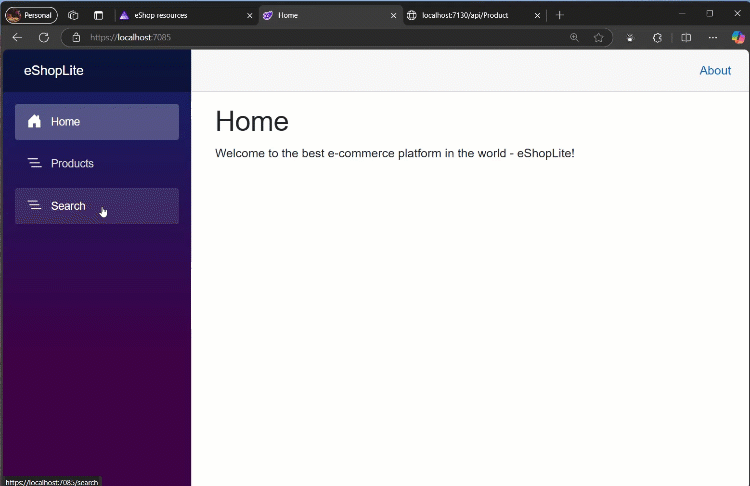
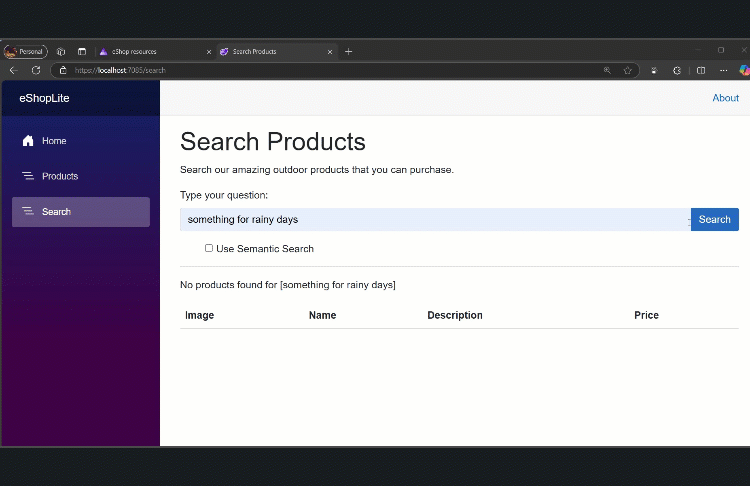
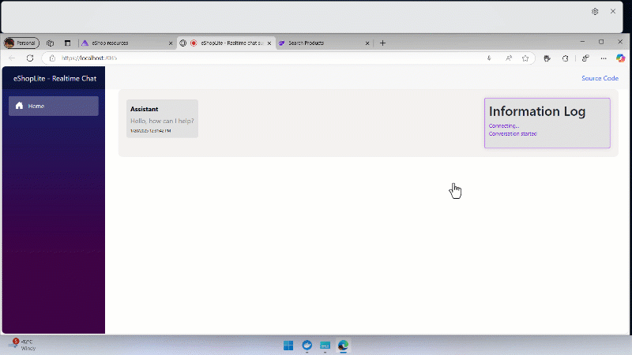
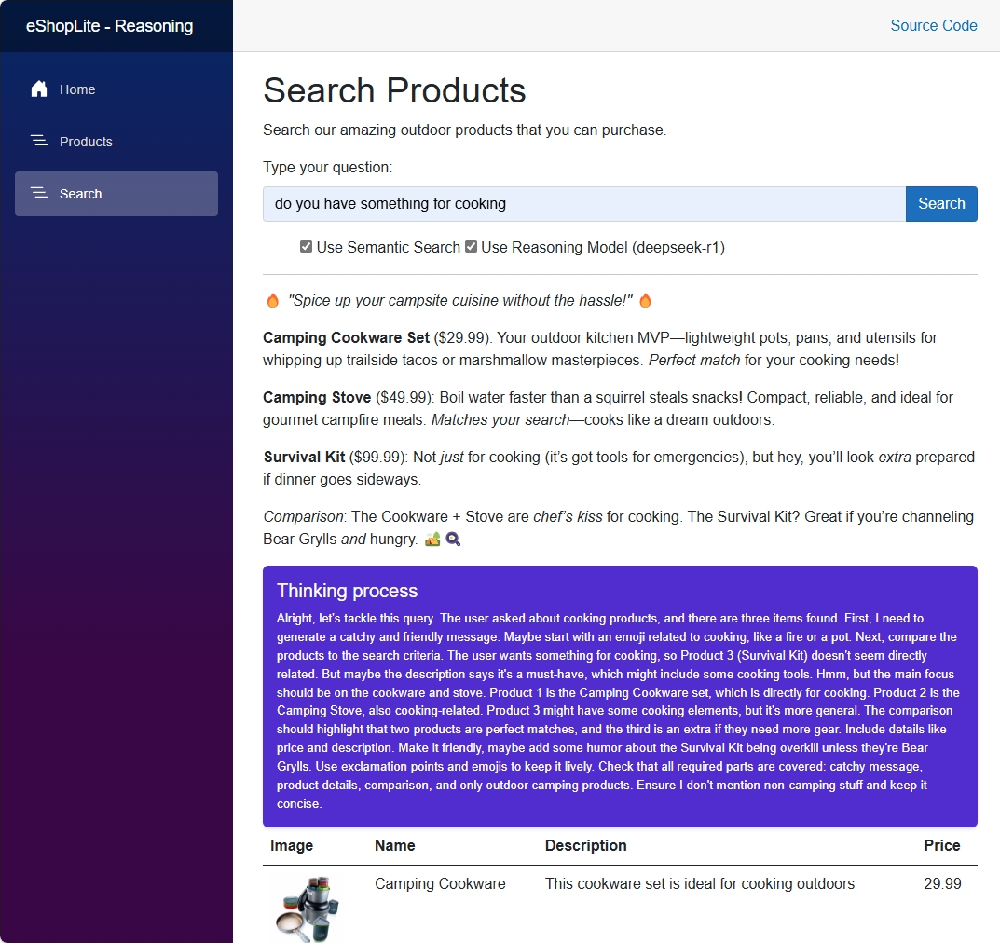
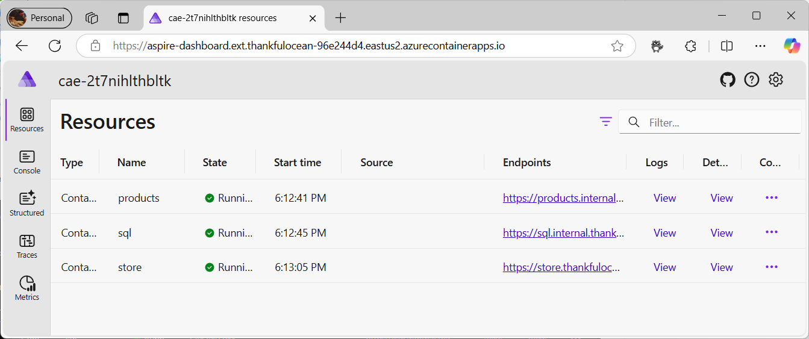
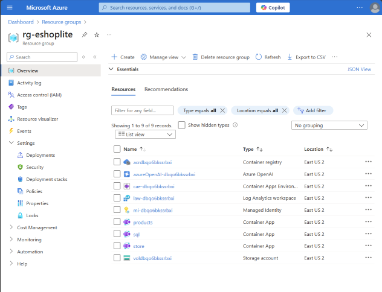

# eShopLite

[](https://github.com/azure-samples/eshoplite/blob/main/LICENSE)
[](https://github.com/azure-samples/eshoplite/graphs/contributors/)
[](https://github.com/azure-samples/eshoplite/issues/)
[](https://github.com/azure-samples/eshoplite/pulls/)
[](http://makeapullrequest.com)

[](https://github.com/azure-samples/eshoplite/watchers/)
[](https://github.com/azure-samples/eshoplite/network/)
[](https://github.com/azure-samples/eshoplite/stargazers/)

[](https://aka.ms/ai-discord/dotnet)

[](https://aka.ms/ai-discussions/dotnet)

**eShopLite** is a set of reference .NET applications implementing an eCommerce site with features like Semantic Search, Model Context Protocol (MCP), Reasoning models, vector databases, and more.

> - ☁️ **All scenarios in this repository use the latest version of .NET and leverage .NET Aspire to orchestrate the entire solution.**
> - 🌟 Don't forget to **[star (🌟) this repo](https://docs.github.com/en/get-started/exploring-projects-on-github/saving-repositories-with-stars)** to find it easier later.
> - ➡️ Get your own copy by **[Forking this repo](https://github.com/azure-samples/eshoplite/fork)** and find it next in your own repositories.
> - ❓ **Have a question?** Besides creating [issues](https://github.com/azure-samples/eshoplite/issues) or [pull requests](https://github.com/azure-samples/eshoplite/pulls), the best option for questions is to join the [Azure AI Discord channel](https://discord.com/invite/ByRwuEEgH4), where a team of AI experts can help you.

## Features

This project framework provides the following features:

- Modern .NET application architecture with .NET Aspire
- Various search capabilities (keyword search, semantic search)
- Integration with multiple AI models (GPT-4o, DeepSeek-R1, etc.)
- Vector database implementations (In Memory, Azure AI Search, Chroma DB and others)
- Real-time audio capabilities
- Model Context Protocol (MCP) server and client implementation

## eShopLite Scenarios

The project includes several scenarios demonstrating different capabilities:

| Scenario | Description | Key Technologies |
|----------|-------------|-----------------|
| [01 - Semantic Search](./scenarios/01-SemanticSearch/) | A reference .NET application implementing an eCommerce site with Search features using Keyword Search and Semantic Search. | .NET Aspire, OpenAI GPT-4.1-mini, In-memory Vector DB |
| [02 - Azure AI Search](./scenarios/02-AzureAISearch/) | Implements an eCommerce site with Keyword Search using SQL queries and Semantic Search with Vector Database and Azure AI Search. | Azure AI Search, OpenAI Embeddings, SQL Server |
| [03 - Realtime Audio](./scenarios/03-RealtimeAudio/) | Extends the eCommerce site with advanced search features and real-time audio capabilities powered by the GPT-4o Realtime Audio API. | GPT-4o Realtime Audio API, Audio in Blazor, .NET Aspire |
| [04 - Chroma DB](./scenarios/04-chromadb/) | Implements semantic search functionality using Chroma DB, an open-source database designed for AI applications. | Chroma DB, OpenAI Embeddings, .NET SDK |
| [05 - DeepSeek-R1](./scenarios/05-deepseek/) | Demonstrates integration of the DeepSeek-R1 model for enhanced semantic understanding and search capabilities. | DeepSeek-R1, .NET Aspire, Vector Embeddings |
| [06 - Model Context Protocol (MCP)](./scenarios/06-mcp/) | Implements the Model Context Protocol (MCP) for advanced AI interactions with MCP Servers and MCP Clients. | Model Context Protocol, Function Calling, SSE Events |
| [07 - Agents Concurrent](./scenarios/07-AgentsConcurrent/) | Demonstrates concurrent agent orchestration and advanced AI agent collaboration patterns. | .NET Aspire, Multi-Agent Systems, Orchestration |
| [08 - SQL Server 2025](./scenarios/08-Sql2025/) | Demonstrates the use of vector search and vector indexes in the SQL Database Engine | SQL Server 2025, Vector Search, Vector Indexes |
| [09 - Azure App Service](./scenarios/09-AzureAppService/) | Shows how to deploy a .NET Aspire multi-service eCommerce app to Azure App Service, using SQLite for data and integrating AI search. | Azure App Service, .NET Aspire, OpenAI, SQLite |
| [10 - A2A Network](./scenarios/10-A2ANet/) | Demonstrates advanced agent-to-agent (A2A) communication and orchestration patterns in .NET Aspire, including multi-agent collaboration and reasoning. | .NET Aspire, Multi-Agent Systems, A2A Protocol |
| [11 - GitHub Models](./scenarios/11-GitHubModels/) | Local-first AI development using GitHub Models during local runs, with automatic switch to Azure OpenAI when deployed. | .NET Aspire, GitHub Models, Azure OpenAI |
| [12 - Azure Functions](./scenarios/12-AzureFunctions/) | Optional Azure Functions façade for semantic search and an alternate deployment boundary for vector search. | Azure Functions, .NET Aspire, Azure OpenAI |
| [13 - Observability Assistant with Foundry Local](./scenarios/13-ObservabilityAssistantFoundryLocal/) | Summarizes logs, traces, and incidents with a local-first observability assistant. | Aspire, OpenTelemetry, Foundry Local, Microsoft.Extensions.AI |
| [14 - Product Discovery Copilot](./scenarios/14-ProductDiscoveryCopilot/) | Turns search into natural-language product discovery with grounded explanations. | Semantic search, vector search, Microsoft.Extensions.AI |
| [15 - Store Intelligence Report](./scenarios/15-StoreIntelligenceReport/) | Generates daily business and operational store intelligence reports. | App data, telemetry, AI summarization, reports |
| [16 - MCP Store Operations Tools](./scenarios/16-MCPStoreOperationsTools/) | Exposes safe store capabilities as MCP tools for agent use. | MCP, Aspire, app APIs, tool calling |
| [17 - A2A Store Operations Network](./scenarios/17-A2AStoreOperationsNetwork/) | Shows specialized agents collaborating around the store app through A2A. | A2A, Microsoft Agent Framework, hosted agents |
| [18 - MAF Development UI](./scenarios/18-MAFDevUI/) | Optional developer aid that visualizes and debugs Microsoft Agent Framework agents and workflows with DevUI. | Microsoft Agent Framework, DevUI, Aspire |

## Getting Started

### Prerequisites

- [.NET 10](https://dotnet.microsoft.com/download/dotnet/10.0)
- [Docker Desktop](https://www.docker.com/products/docker-desktop/) or [Podman](https://podman.io/)
- [Azure Developer CLI (azd)](https://aka.ms/install-azd) (for Azure deployment)
- [Git](https://git-scm.com/downloads)
- [Aspire CLI](https://aspire.dev) — install with `dotnet tool install -g aspire.cli` (used for setting local secrets via `aspire secret set`)

### Installation

1. Clone the repository:

   ```bash
   git clone https://github.com/Azure-Samples/eShopLite.git
   ```

1. Navigate to the scenario directory of interest:

   ```bash
   cd eShopLite/scenarios/[scenario-folder]
   ```

1. Login to Azure:

    ```shell
    azd auth login
    ```

1. Provision and deploy all the resources:

    ```shell
    azd up
    ```

    It will prompt you to provide an `azd` environment name (like "eShopLite"), select a subscription from your Azure account, and select a [location where the necessary models, like gpt-4.1-mini and ADA-002 are available](https://azure.microsoft.com/explore/global-infrastructure/products-by-region/?products=cognitive-services&regions=all), a sample region can be "eastus2".

### Quick setup — Azure OpenAI secrets

The script `scripts\Set-AzureOpenAISecrets.ps1` configures all 17 scenarios at once. Run it from the **repo root**:

```powershell
pwsh .\scripts\Set-AzureOpenAISecrets.ps1
```

The script interactively prompts for four values:

| Prompt | Parameter set |
|--------|---------------|
| Azure OpenAI endpoint | `Parameters:AzureOpenAIEndpoint` |
| Azure OpenAI API key *(masked)* | `Parameters:AzureOpenAIApiKey` |
| Chat deployment name | `Parameters:AzureOpenAIDeploymentName` |
| Embeddings deployment name | `Parameters:AzureOpenAIEmbeddingsDeploymentName` |

Use `-DryRun` to preview the commands without executing them:

```powershell
pwsh .\scripts\Set-AzureOpenAISecrets.ps1 -DryRun
```

Internally, the script calls the **Aspire CLI** (`aspire secret set`) for each AppHost it discovers. To set a single value manually, use the same command directly:

```bash
aspire secret set Parameters:AzureOpenAIEndpoint "https://<your-resource>.openai.azure.com/" \
  --apphost scenarios/01-SemanticSearch/src/eShopAppHost/eShopAppHost.csproj
```

> **Note:** Scenario-specific extra parameters (e.g., `Parameters:AzureOpenAIRealtimeDeploymentName` in 03-RealtimeAudio, `Parameters:DeepSeekEndpoint` in 05-deepseek, `Parameters:GitHubModelsToken` in 11-GitHubModels) must still be set manually. See each scenario's README for details.

### Quickstart

1. Navigate to a specific scenario folder (e.g., `scenarios/01-SemanticSearch/`)
2. Follow the README instructions in that scenario folder
3. Run the solution using `dotnet run` in the appropriate host project folder

## Demo

To run the demo, follow these steps:

1. Navigate to the specific scenario folder
2. Follow the "Run the solution" instructions in that scenario's README
3. Access the application via the URLs provided in the console output

## Sample Application

This is the eShopLite Aplication running, performing a **Keyword Search**:



This is the eShopLite Aplication running, performing a **Semantic Search**:



This is the eShopLite Application running the **Realtime Audio** feature:



This is the eShopLite Application using the **DeepSeek-R1 Reasoning Model**:



The Aspire Dashboard to check the running services:



The Azure Resource Group with all the deployed services:



## Resources

- [Generative AI for Beginners .NET](https://aka.ms/genainet)

- [.NET Aspire Documentation](https://learn.microsoft.com/dotnet/aspire/)

- [Azure OpenAI Service Documentation](https://learn.microsoft.com/azure/ai-services/openai/)

## Getting Help

If you get stuck or have questions about building AI apps, join:

[](https://aka.ms/foundry/discord)

If you have product feedback or errors while building, visit:

[](https://aka.ms/foundry/forum)
