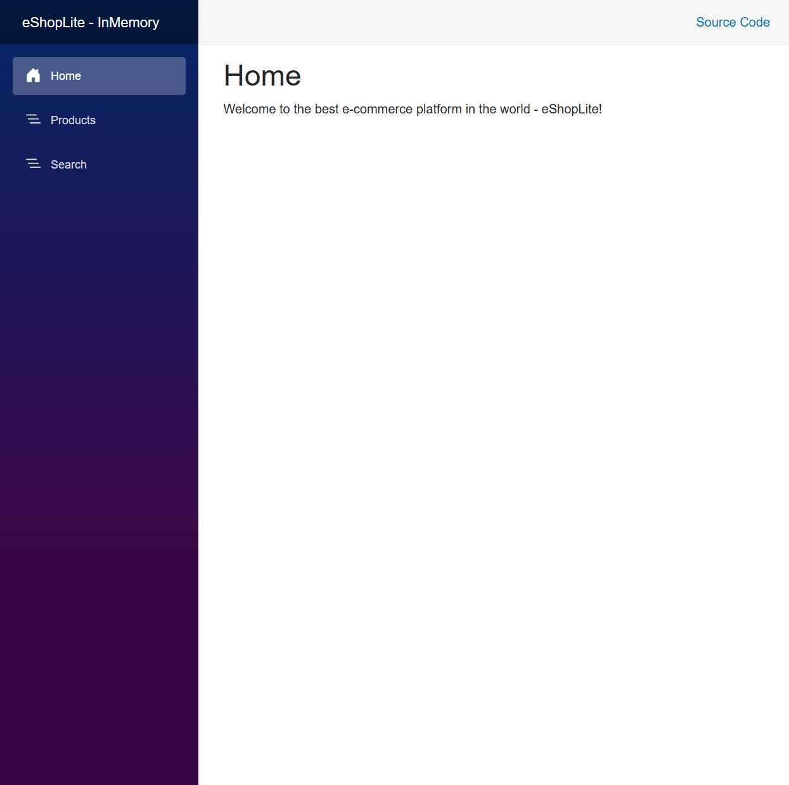
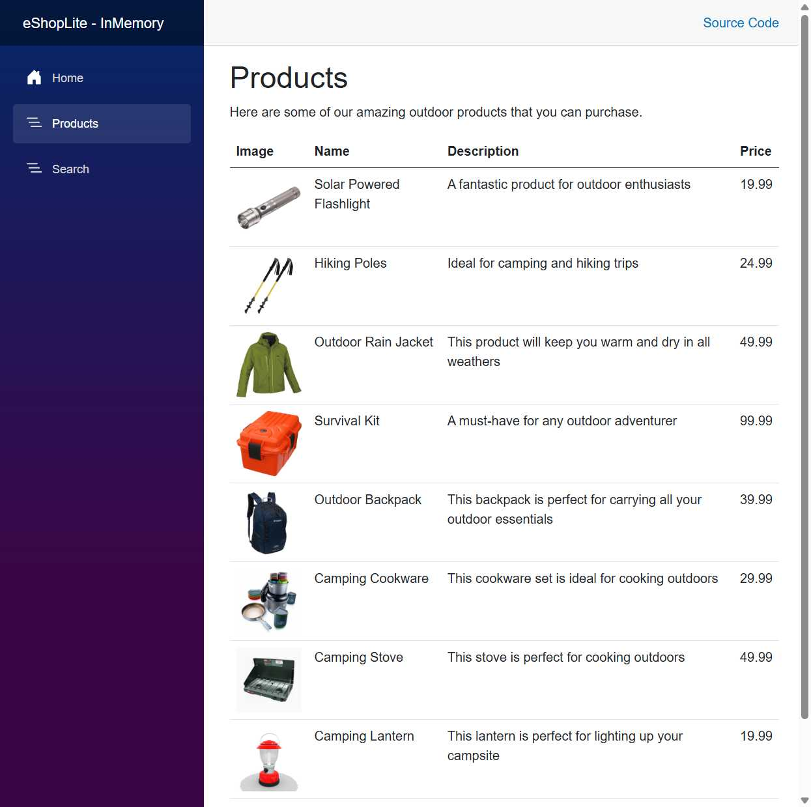
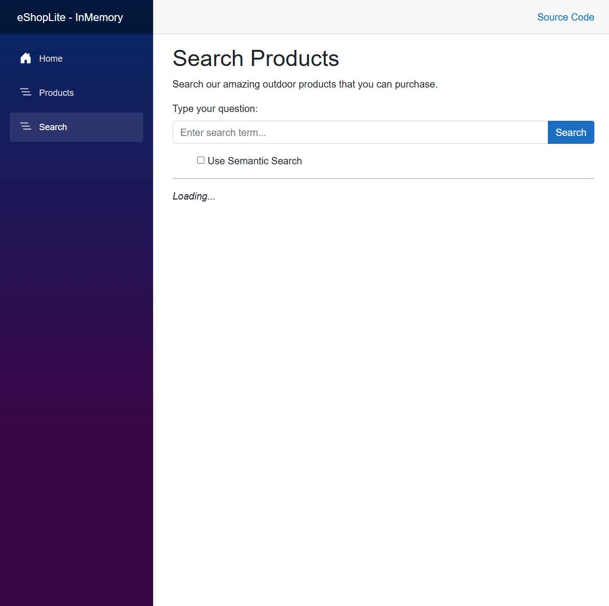

# eShopLite Semantic Search Scenario

This document describes the main features of the eShopLite application in the Semantic Search scenario and provides visual references for key UI pages.

## Main Features

- **Home Page**: Welcome page introducing eShopLite as a modern e-commerce platform.
- **Products Page**: Displays a list of outdoor products with images, descriptions, and prices.
- **Search Page**: Allows users to search for products using both keyword and semantic search. Includes an option to enable semantic search for more relevant results.
- **Aspire Dashboard**: .NET Aspire dashboard for managing and monitoring backend and frontend services.

## Screenshots

### Aspire Dashboard

### Store Frontend - Home Page

### Store Frontend - Products Page

### Store Frontend - Search Page

All screenshots are located in the `screenshots` folder for this scenario.
