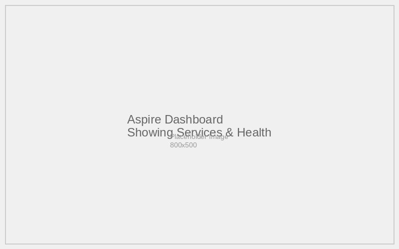
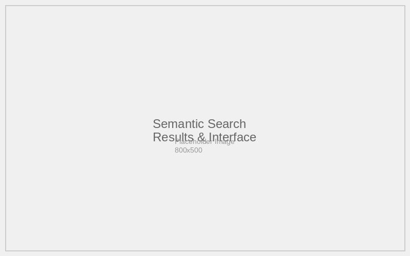

# Semantic Search Documentation

## Overview
The 01-SemanticSearch scenario demonstrates a modern eCommerce application with AI-powered semantic search capabilities using .NET Aspire, Azure OpenAI, and vector embeddings.

## Features

### Core Services
- **Aspire Orchestration**: Coordinated microservices architecture with dependency management
- **Azure OpenAI Integration**: Advanced AI capabilities for chat and semantic search
- **Application Insights**: Comprehensive telemetry and monitoring

### Feature Documentation
- [Aspire Orchestration](aspire-orchestration.md) - Service coordination and dependency management
- [Azure OpenAI Integration](azure-openai-integration.md) - AI models and semantic search
- [Application Insights](application-insights.md) - Telemetry and monitoring

## Architecture
The scenario consists of three main components:
1. **SQL Server Database** - Persistent data storage
2. **Products Service** - REST API with semantic search capabilities
3. **Store Web Application** - Blazor frontend with search UI

## AI Capabilities
- **Semantic Search**: Uses text-embedding-ada-002 to understand search intent
- **Chat Completion**: GPT-4.1 Mini for product recommendations
- **Vector Similarity**: Finds products based on meaning, not just keywords

## Configuration Requirements
- Azure OpenAI Service with deployed models
- User secrets for API keys and endpoints
- .NET 9 runtime environment
- SQL Server container support

## Screenshots

### Aspire Dashboard

*The Aspire Dashboard showing all running services and their health status*

### Products Listing

*The main products page displaying the eShop catalog*

### Semantic Search

*The semantic search interface showing AI-powered product discovery*

## Getting Started
1. Set up Azure OpenAI Service with required models
2. Configure user secrets for API keys
3. Run `dotnet run --project src/eShopAppHost/eShopAppHost.csproj`
4. Navigate to the Aspire Dashboard to monitor services
5. Use the Store web application to test semantic search