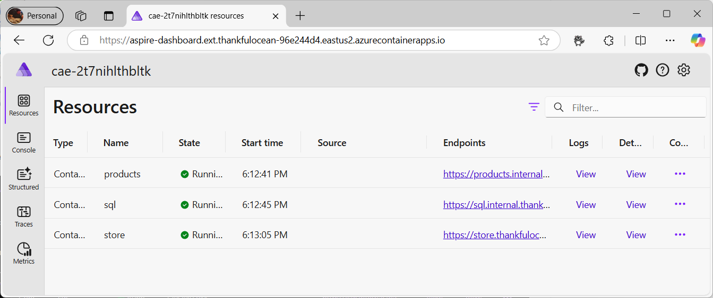
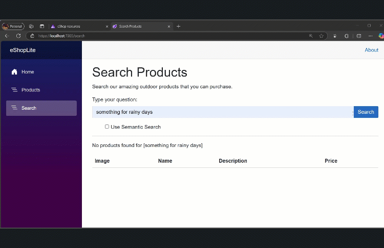

# eShopLite 01-SemanticSearch Documentation

## Overview

This documentation covers the **01-SemanticSearch** scenario of the eShopLite .NET Aspire sample application. This scenario demonstrates an eCommerce platform with advanced AI-powered semantic search capabilities, showcasing the integration of Azure OpenAI, vector databases, and modern .NET Aspire orchestration patterns.

## High-Level Architecture

The solution consists of three main services orchestrated by .NET Aspire:

- **eShopAppHost** - Aspire orchestrator managing service discovery, configuration, and Azure resource bindings
- **Products Service** - REST API with Azure OpenAI integration for product management and semantic search
- **Store Service** - Blazor Server web application providing the user interface for product browsing and search

## Features Documentation

### Core Infrastructure
- [**Aspire Orchestration**](./aspire-orchestration.md) - Service discovery, configuration management, and Azure resource orchestration
- [**SQL Server Database**](./sql-server-database.md) - Product catalog storage with Entity Framework Core
- [**Telemetry and Monitoring**](./telemetry-monitoring.md) - Observability with Aspire Dashboard and Azure Application Insights

### AI and Search Capabilities  
- [**Azure OpenAI Integration**](./azure-openai-integration.md) - Chat completion and text embedding services
- [**Semantic Search Engine**](./semantic-search-engine.md) - Vector-based product search with in-memory vector store

### User Interface
- [**Blazor Web Application**](./blazor-web-application.md) - Interactive server-side web application with search capabilities

## Application Screenshots

### Aspire Dashboard


*The Aspire Dashboard showing all running services, their health status, and telemetry data.*

### Product Catalog


*The main product listing page displaying the outdoor product catalog.*

### Semantic Search Interface


*The search page with semantic search toggle and AI-generated responses.*

## Key Technologies

- **.NET 9.0** - Modern .NET platform
- **.NET Aspire** - Cloud-native orchestration framework
- **Blazor Server** - Interactive web UI framework
- **Azure OpenAI** - GPT-4.1-mini and text-embedding-ada-002 models
- **Entity Framework Core** - Data access with SQL Server
- **Microsoft Semantic Kernel** - In-memory vector store for semantic search
- **OpenTelemetry** - Distributed tracing and metrics collection

## Getting Started

1. **Prerequisites**
   - .NET 9.0 SDK
   - Docker/Podman for SQL Server
   - Azure OpenAI resource (for production)

2. **Local Development Setup**
   ```bash
   cd scenarios/01-SemanticSearch/src/eShopAppHost
   dotnet user-secrets set "openai:Endpoint" "https://your-resource.openai.azure.com/"
   dotnet user-secrets set "openai:Key" "your-api-key"
   ```

3. **Run the Application**
   ```bash
   dotnet run --project src/eShopAppHost/eShopAppHost.csproj
   ```

4. **Access the Application**
   - Aspire Dashboard: Will be displayed in console output
   - Web Application: Available through Aspire Dashboard or direct service URL

## Configuration

### Local Development
- Uses containerized SQL Server
- Azure OpenAI configured via user secrets
- Aspire Dashboard for monitoring

### Production (Azure)
- Azure SQL Database
- Azure OpenAI Service
- Azure Application Insights
- Azure Container Apps hosting

## External Dependencies

- **Azure OpenAI Service** - For chat completion and text embeddings
- **SQL Server** - Product catalog storage
- **Azure Application Insights** - Production telemetry (optional)

## Related Resources

- [Main Scenario README](../README.md) - Setup instructions and deployment guide
- [.NET Aspire Documentation](https://learn.microsoft.com/en-us/dotnet/aspire/)
- [Azure OpenAI Service](https://azure.microsoft.com/en-us/products/ai-services/openai-service)