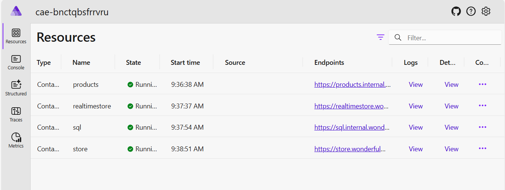

# 03-RealtimeAudio - Documentation

## Overview

The 03-RealtimeAudio scenario extends the eCommerce platform with real-time audio chat capabilities powered by GPT-4o Realtime API. This scenario demonstrates integration of conversational AI for product inquiries alongside traditional search functionality.

## Features Documentation

This scenario implements the following key features:

- [Azure OpenAI Integration](./azure-openai-integration.md) - GPT-4o-mini, GPT-4o-realtime-preview, and text-embedding-ada-002
- [SQL Server Database](./sql-server-database.md) - Product data storage and management
- [Products Service](./products-service.md) - REST API for product operations with AI-powered search
- [Store Frontend](./store-frontend.md) - Traditional Blazor web application with search interface
- [Realtime Store](./realtime-store.md) - Real-time audio chat interface for product inquiries
- [Vector Entities](./vector-entities.md) - Product vector storage and similarity search
- [Service Defaults](./service-defaults.md) - .NET Aspire service configuration and telemetry

## Architecture

The solution follows a microservices architecture with dual frontend applications:

```
┌─────────────────┐    ┌─────────────────┐    ┌─────────────────┐
│   Store (UI)    │───▶│  Products API   │───▶│   SQL Server    │
└─────────────────┘    └─────────────────┘    └─────────────────┘
                              │
┌─────────────────┐           ▼
│ RealtimeStore   │    ┌─────────────────┐
│ (Audio Chat)    │───▶│ Azure OpenAI    │
└─────────────────┘    │ - GPT-4o-mini   │
                       │ - GPT-4o-realtime│
                       │ - Embeddings    │
                       └─────────────────┘
```

## Key Differentiators

### Realtime Audio Features
- **Voice Input**: Users can speak product inquiries naturally
- **Voice Response**: AI responds with synthesized speech
- **Real-time Processing**: Low-latency audio conversation
- **Product Integration**: Audio chat connected to product database

### Dual Frontend Architecture
- **Traditional Store**: Standard web interface with search
- **Realtime Store**: Audio-first conversational interface
- **Shared Backend**: Both frontends use the same Products API

## Screenshots

### Aspire Dashboard


### Products Listing


### Realtime Audio Chat


## Getting Started

1. Navigate to the scenario directory: `cd scenarios/03-RealtimeAudio/src/eShopAppHost`
2. Run the application: `dotnet run`
3. Access the Aspire Dashboard using the login URL displayed in the console
4. Navigate to the Store application for traditional search
5. Navigate to the RealtimeStore application for audio chat

## Configuration

The application uses Azure OpenAI services with enhanced realtime capabilities:

### Required Models
- **gpt-4o-mini**: For chat and product recommendations
- **gpt-4o-realtime-preview**: For real-time audio conversations  
- **text-embedding-ada-002**: For semantic search embeddings

### Configuration Sources
- User secrets for local development
- Azure resources when deployed to production
- Environment variables for deployment names and endpoints

See individual feature documentation for detailed configuration instructions.