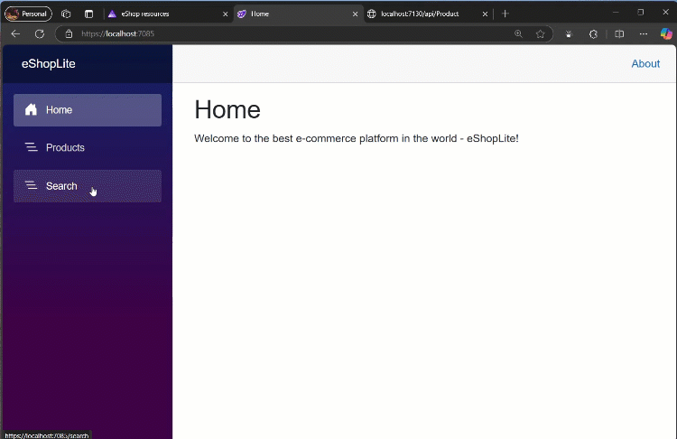

# 05-deepseek - Documentation

## Overview

The 05-deepseek scenario integrates the advanced DeepSeek-R1 model alongside Azure OpenAI services to provide enhanced semantic search capabilities. This scenario demonstrates cutting-edge AI reasoning for improved product understanding and search relevance.

## Features Documentation

This scenario implements the following key features:

- [DeepSeek-R1 Integration](./deepseek-r1-integration.md) - Advanced reasoning model for enhanced search
- [Azure OpenAI Integration](./azure-openai-integration.md) - GPT-4.1-mini and text-embedding-ada-002
- [SQL Server Database](./sql-server-database.md) - Product data storage with persistent volumes
- [Products Service](./products-service.md) - REST API enhanced with reasoning capabilities
- [Store Frontend](./store-frontend.md) - Blazor web application with advanced search
- [Vector Entities](./vector-entities.md) - Enhanced vector storage for reasoning
- [Service Defaults](./service-defaults.md) - .NET Aspire service configuration

## Architecture

The solution combines Azure OpenAI with DeepSeek-R1 for enhanced AI capabilities:

```
┌─────────────────┐    ┌─────────────────┐    ┌─────────────────┐
│   Store (UI)    │───▶│  Products API   │───▶│   SQL Server    │
└─────────────────┘    └─────────────────┘    └─────────────────┘
                              │
                              ▼
                    ┌─────────────────────┐
                    │    AI Services      │
                    │                     │
                    │ ┌─────────────────┐ │
                    │ │ Azure OpenAI    │ │
                    │ │ - GPT-4.1-mini  │ │
                    │ │ - Embeddings    │ │
                    │ └─────────────────┘ │
                    │                     │
                    │ ┌─────────────────┐ │
                    │ │  DeepSeek-R1    │ │
                    │ │  (Reasoning)    │ │
                    │ └─────────────────┘ │
                    └─────────────────────┘
```

## Key Differentiators

### DeepSeek-R1 Reasoning Model
- **Advanced Reasoning**: Enhanced logical reasoning for complex product queries
- **Improved Relevance**: Better understanding of user intent and product relationships
- **Multi-step Analysis**: Ability to break down complex search requests
- **Contextual Understanding**: Deeper comprehension of product features and use cases

### Dual AI Architecture
- **Azure OpenAI**: Handles embeddings and standard chat operations
- **DeepSeek-R1**: Provides advanced reasoning and analysis
- **Complementary Models**: Each AI service optimized for specific tasks
- **Fallback Strategies**: Graceful degradation if either service is unavailable

## Screenshots

### Aspire Dashboard


### Products Listing


### DeepSeek Reasoning Search


## Getting Started

1. Navigate to the scenario directory: `cd scenarios/05-deepseek/src/eShopAppHost`
2. Run the application: `dotnet run`
3. Access the Aspire Dashboard using the login URL displayed in the console
4. Navigate to the Store application to test enhanced search functionality

## Configuration

The application requires configuration for both Azure OpenAI and DeepSeek services:

### Azure OpenAI Models
- **gpt-4.1-mini**: Standard chat and product recommendations
- **text-embedding-ada-002**: Vector embeddings for semantic search

### DeepSeek Models  
- **DeepSeek-R1**: Advanced reasoning model for complex queries

### Infrastructure as Code
The scenario includes Bicep templates for Azure deployment:
- `deepseekr1.module.bicep`: DeepSeek-R1 service provisioning
- `main.bicep`: Complete infrastructure orchestration
- Automatic resource provisioning with proper IAM configuration

### Configuration Sources
- User secrets for local development
- Azure resources when deployed to production
- Environment variables for deployment names and endpoints
- Bicep parameters for infrastructure customization

See individual feature documentation for detailed configuration instructions.