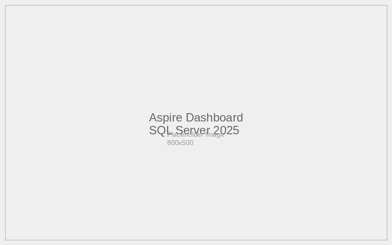
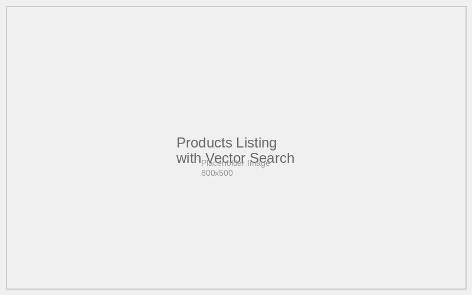
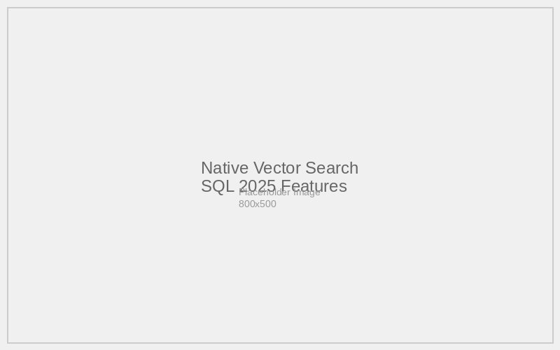

# 08-Sql2025 - Documentation

## Overview

The 08-Sql2025 scenario demonstrates integration with SQL Server 2025 latest features alongside Azure OpenAI services. This scenario showcases modern database capabilities combined with AI-powered search in an eCommerce platform.

## Features Documentation

This scenario implements the following key features:

- [SQL Server 2025 Integration](./sql-server-2025-integration.md) - Latest SQL Server features and capabilities
- [Azure OpenAI Integration](./azure-openai-integration.md) - GPT-4.1-mini and text-embedding-3-small
- [Products Service](./products-service.md) - REST API with SQL 2025 optimizations
- [Store Frontend](./store-frontend.md) - Blazor web application with modern search
- [Vector Search](./vector-search.md) - SQL Server 2025 vector capabilities
- [Service Defaults](./service-defaults.md) - .NET Aspire service configuration

## Architecture

The solution leverages SQL Server 2025 as the primary data and vector store:

```
┌─────────────────┐    ┌─────────────────┐    ┌─────────────────┐
│   Store (UI)    │───▶│  Products API   │───▶│  SQL Server     │
└─────────────────┘    └─────────────────┘    │    2025         │
                              │              │                 │
                              ▼              │ - Product Data  │
                       ┌─────────────────┐    │ - Vector Store  │
                       │ Azure OpenAI    │───▶│ - AI Features   │
                       │ - GPT-4.1-mini  │    └─────────────────┘
                       │ - Embeddings    │
                       └─────────────────┘
```

## Key Differentiators

### SQL Server 2025 Features
- **Latest Container Image**: Uses `microsoft/mssql-server:2025-latest`
- **Enhanced Performance**: Latest optimizations and improvements
- **Modern Data Types**: Advanced data type support
- **Integrated AI**: Built-in AI and ML capabilities
- **Vector Support**: Native vector storage and search

### Advanced Database Integration
- **Persistent Volumes**: Data persistence across container restarts
- **Container Lifetime Management**: Persistent container lifecycle
- **Modern Connection Patterns**: Optimized for cloud-native applications
- **Enhanced Security**: Latest security features and protocols

## Screenshots

### Aspire Dashboard


### Products Listing


### SQL 2025 Search


## Getting Started

1. Navigate to the scenario directory: `cd scenarios/08-Sql2025/src/eShopAppHost`
2. Ensure Docker/Podman is running for SQL Server 2025 container
3. Run the application: `dotnet run`
4. Access the Aspire Dashboard using the login URL displayed in the console
5. Navigate to the Store application to test SQL 2025 enhanced features

## Configuration

The application uses SQL Server 2025 with Azure OpenAI integration:

### SQL Server 2025 Configuration
- **Container Image**: `microsoft/mssql-server:2025-latest`
- **License**: EULA acceptance required (`ACCEPT_EULA=Y`)
- **Persistence**: Data volumes for production workloads
- **Lifecycle**: Persistent container management

### Azure OpenAI Models
- **gpt-4.1-mini**: Chat and product recommendations  
- **text-embedding-3-small**: Enhanced embedding model for better search

### Environment Configuration
The application adapts between local development and production:
- **Local**: Uses connection strings for external services
- **Production**: Full Azure resource provisioning via Aspire
- **Hybrid**: Supports mixed local/cloud development scenarios

See individual feature documentation for detailed configuration instructions.