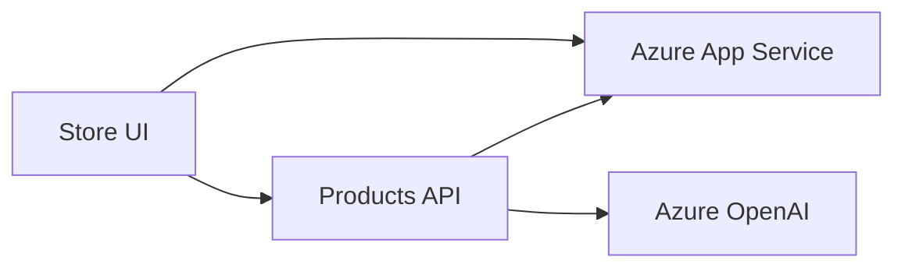

# 09-AzureAppService Scenario Documentation

## Overview
This scenario shows how the modernized eShopLite Store + Products experience deploys to Azure App Service using Aspire orchestration and Azure OpenAI.

## Derived from
This scenario is derived from **01 - Semantic Search** because it reuses the same Store/Products baseline and search experience; the difference here is the deployment target and App Service-focused infrastructure.

## What this scenario demonstrates
- Azure App Service hosting for the Store and Products services
- Aspire AppHost orchestration
- Azure OpenAI for chat and embeddings
- Semantic search UX carried into an Azure App Service deployment

## Architecture


## Features
- [Azure App Service Environment](./docs/azure-appservice.md)
- [Scenario documentation](./docs/README.md)
- [Products API](./docs/products-api.md)
- [Store UI](./docs/store-ui.md)
- [Azure OpenAI](./docs/azure-openai.md)

## Prerequisites
- .NET 10 SDK
- Azure Developer CLI
- Azure OpenAI resource with chat and embeddings deployments
- Docker Desktop or Podman for local containers

## Required configuration
Set the following Aspire parameters in the `eShopAppHost` project:

```bash
aspire secret set Parameters:AzureOpenAIEndpoint "https://<your-resource>.openai.azure.com/" --apphost scenarios/09-AzureAppService/src/eShopAppHost/eShopAppHost.csproj
aspire secret set Parameters:AzureOpenAIApiKey "<your-api-key>" --apphost scenarios/09-AzureAppService/src/eShopAppHost/eShopAppHost.csproj
aspire secret set Parameters:AzureOpenAIDeploymentName "gpt-4.1-mini" --apphost scenarios/09-AzureAppService/src/eShopAppHost/eShopAppHost.csproj
aspire secret set Parameters:AzureOpenAIEmbeddingsDeploymentName "text-embedding-ada-002" --apphost scenarios/09-AzureAppService/src/eShopAppHost/eShopAppHost.csproj
```

## How to run locally
```bash
cd scenarios/09-AzureAppService/src/eShopAppHost
dotnet run
```

## How to run the demo
1. Start the AppHost.
2. Open the Store UI URL from the console.
3. Search for products with both keyword and semantic intent.
4. Open the Aspire dashboard to verify the App Service and OpenAI resources.

## Expected output
- Store UI loads successfully
- Products API responds through Aspire wiring
- Semantic search results are returned from the catalog
- Azure OpenAI calls succeed with the configured parameters

## Troubleshooting
- Check that the four Aspire parameters are set on the AppHost project.
- Confirm the Azure OpenAI deployment names match your resource.
- Verify Docker/Podman is running before `dotnet run`.
- If Azure deployment fails, confirm `azd auth login` succeeded.

## Session docs
See the session plan and presentation docs in:

[`docs/26 06 16 NET Agentic Modernization`](../../docs/26%2006%2016%20NET%20Agentic%20Modernization/README.md)
