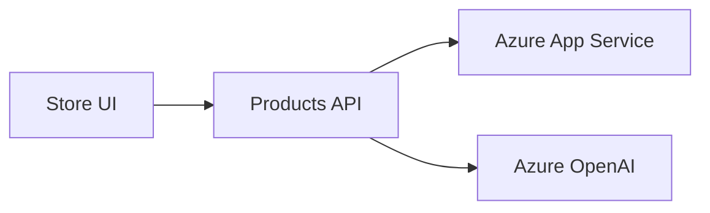

# 09-AzureAppService Scenario Documentation

## Overview
This scenario demonstrates deployment of the modernized eShopLite Store + Products app to Azure App Service, with AI-powered search and chat using Azure OpenAI.

## Derived from
This scenario is derived from **01 - Semantic Search** because it keeps the same UI, catalog, and semantic search baseline while changing the deployment target to Azure App Service.

## Features
- [Azure App Service Environment](./azure-appservice.md)
- [Products API](./products-api.md)
- [Store UI](./store-ui.md)
- [Azure OpenAI](./azure-openai.md)

## Architecture

## Screenshots

### Aspire Dashboard

### Products Listing

### Semantic Search

## Session docs
See the agentic modernization session docs at [`docs/26 06 16 NET Agentic Modernization`](../../../docs/26%2006%2016%20NET%20Agentic%20Modernization/README.md).
