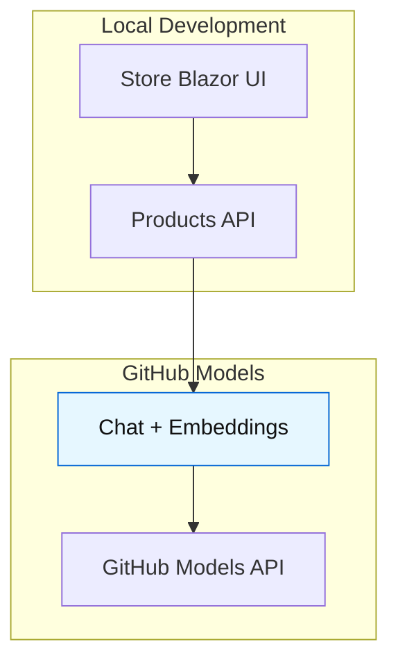
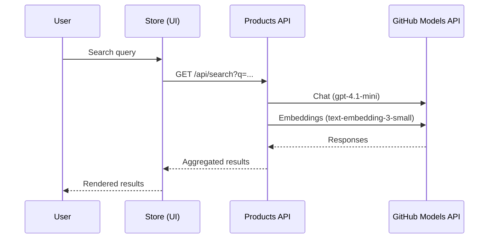

# eShopLite Scenario 11 — GitHub Models (deprecated)

[](/LICENSE)

> [!WARNING]
> **Deprecated scenario.** GitHub Models is being fully retired on **July 30, 2026**, so this scenario is now kept only as an archived reference. Do not use it for new development. Prefer [Scenario 01](../01-SemanticSearch/) or another Azure OpenAI-based scenario in this repository.

This scenario originally ran eShopLite locally using GitHub Models for chat and embeddings, while publish/deploy automatically used Azure OpenAI without code changes. It remains in the repository for reference only. All supported deployment, telemetry, costs, and security guidance live in Scenario 01 and are not duplicated here.

- What you get here: archived documentation for the former local-first GitHub Models setup and how it switched automatically
- What to read in Scenario 01: Azure deployment, telemetry, costs, and security

Quick links:

- Features
- How it works
- Prerequisites
- Historical local run flow
- Architecture and request flow
- Historical troubleshooting
- Resources

## Features (archived Scenario 11)

- Local-first AI via GitHub Models with .NET Aspire
- Automatic switch to Azure OpenAI when published/deployed
- Secure interactive GitHub token prompt (Aspire parameters)
- Same Store UI and Products API behavior across environments

## How it works

Local development uses GitHub Models; publish/deploy uses Azure OpenAI. The Products service toggles via Aspire-provided environment settings:

- AI_UseGitHubModels: true for local; false for publish/deploy
- GitHubModelsToken: GitHub Personal Access Token used locally for GitHub Models (set as `Parameters:GitHubModelsToken`)
- Endpoint (local): [https://models.inference.ai.azure.com](https://models.inference.ai.azure.com)

## Prerequisites (local dev only)

- .NET 10 SDK and .NET Aspire tooling
- Docker Desktop or Podman (recommended)
- GitHub account and access to GitHub Models
- A GitHub Personal Access Token (PAT) with access to GitHub Models

## Historical local run flow

Run from the AppHost so Aspire wires service URLs and secure parameters for you.

```powershell
cd ./src/eShopAppHost/
dotnet run
```

Before GitHub Models retirement, Aspire prompted for your GitHub token as a secure parameter (`Parameters:GitHubModelsToken`). You could also set it manually beforehand:

```bash
aspire secret set Parameters:GitHubModelsToken "<your-github-pat>" --apphost scenarios/11-GitHubModels/src/eShopAppHost/eShopAppHost.csproj
```

> **Tip:** Run `pwsh .\scripts\Set-AzureOpenAISecrets.ps1` from the repo root to set the 4 common Azure OpenAI values for every supported scenario at once. `Parameters:GitHubModelsToken` is only relevant when reviewing this archived sample.

The app then uses:

- Chat: gpt-4.1-mini (GitHub Models)
- Embeddings: text-embedding-3-small (GitHub Models)

When you publish/deploy (see Scenario 01), the app uses Azure OpenAI deployments instead:

- Chat: gpt-4.1-mini (Azure OpenAI)
- Embeddings: text-embedding-ada-002 (Azure OpenAI)

## Architecture (local)



### Request flow (local)



## Troubleshooting (historical local setup)

- Ensure Docker/Podman is running if containers are required by Aspire resources
- If the token prompt doesn’t appear, verify you’re running from the AppHost project
- For a supported local setup, use Azure OpenAI and follow Scenario 01 instead

## Deployment, telemetry, costs, and security

This scenario intentionally keeps those topics centralized in Scenario 01. For complete guidance, follow:

- Scenario 01 README: ../../01-SemanticSearch/README.md
- Scenario 01 Docs: ../../01-SemanticSearch/docs/README.md

## Resources

- GitHub Models: gpt-4.1-mini — <https://github.com/marketplace/models/azure-openai/gpt-4-1-mini>
- GitHub Models: text-embedding-3-small — <https://github.com/marketplace/models/azure-openai/text-embedding-3-small>

Video

- Run eShopLite Semantic Search in Minutes with .NET Aspire & GitHub Codespaces: <https://youtu.be/T9HwjVIDPAE>
