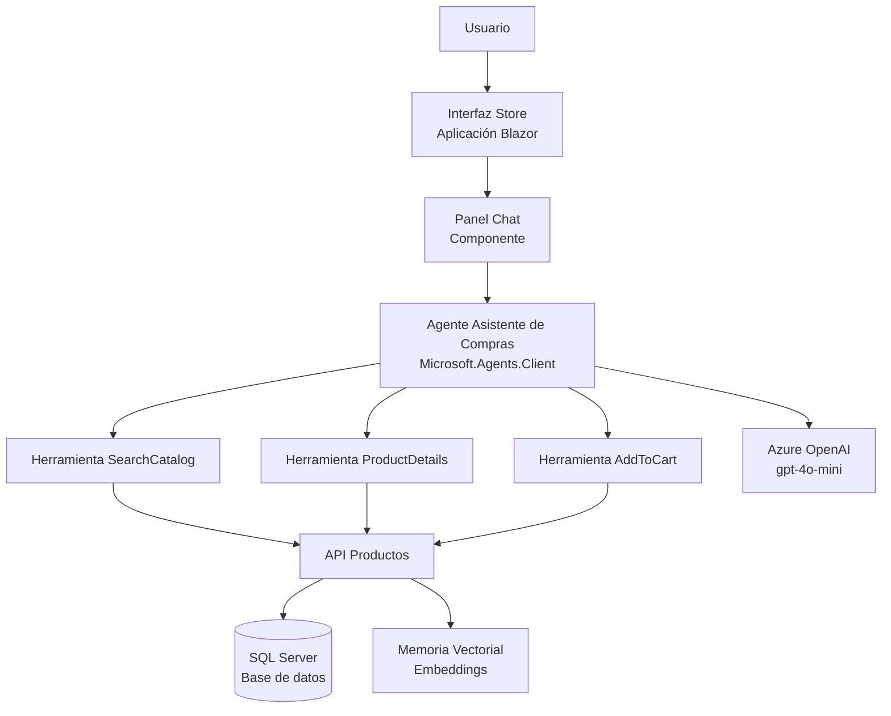
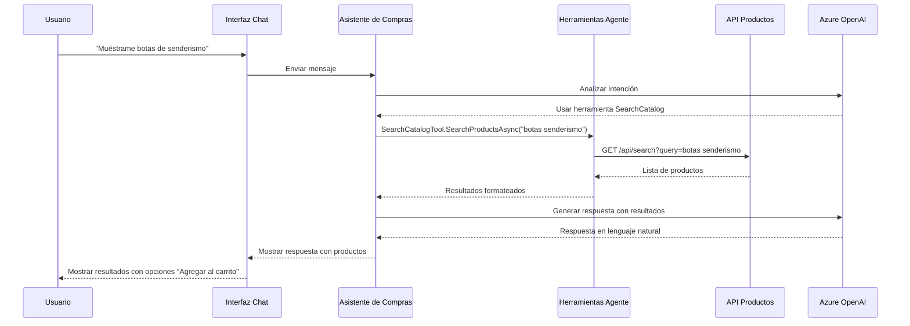

# Escenario 13 - Agente Asistente de Compras con Microsoft Agent Framework

## Descripción

Este escenario demuestra la integración del [Framework de Agentes de Microsoft](https://github.com/microsoft/agent-framework/) con eShopLite para crear un Agente Asistente de Compras inteligente. El agente ayuda a los usuarios a descubrir productos, obtener información detallada y gestionar su carrito de compras a través de conversaciones en lenguaje natural.

El Asistente de Compras utiliza capacidades avanzadas de IA para comprender la intención del usuario, buscar en el catálogo de productos, proporcionar recomendaciones y ayudar con la adición de artículos al carrito - todo a través de una interfaz conversacional.

## Características

- **Comercio Conversacional:** Interacción en lenguaje natural para descubrimiento de productos y compras
- **Integración Microsoft Agent Framework:** Utiliza el SDK Microsoft.Agents.Client más reciente para orquestación de agentes
- **Búsqueda Inteligente de Productos:** Búsqueda de productos impulsada por IA con comprensión semántica
- **Recomendaciones de Productos:** Sugerencias de productos contextuales basadas en consultas de usuario
- **Gestión del Carrito:** Adición de productos al carrito mediante comandos conversacionales
- **Agente Multi-Herramienta:** Tres herramientas especializadas (SearchCatalog, ProductDetails, AddToCart)
- **Integración Azure OpenAI:** Aprovecha modelos GPT para respuestas inteligentes
- **Chat en Tiempo Real:** Interfaz de chat interactiva con respuestas en streaming

## Referencia

- [Microsoft Agent Framework](https://github.com/microsoft/agent-framework/)
- [Paquete NuGet Microsoft.Agents.Client](https://www.nuget.org/packages/Microsoft.Agents.Client/)

## Comenzando

La solución se encuentra en la carpeta `./src`, la solución principal es **[eShopLite-AgentFramework.sln](./src/eShopLite-AgentFramework.sln)**.

## Implementación

Una vez que haya abierto el proyecto en [Codespaces](#github-codespaces), o [localmente](#ejecución-local), puede implementarlo en Azure.

Desde una ventana de Terminal, abra la carpeta con el clon de este repositorio y ejecute los siguientes comandos.

1. Iniciar sesión en Azure:

    ```shell
    azd auth login
    ```

2. Aprovisionar e implementar todos los recursos:

    ```shell
    azd up
    ```

    Le pedirá que proporcione un nombre de entorno `azd` (como "eShopLite-AgentFramework"), seleccione una suscripción de su cuenta de Azure, y seleccione una [ubicación donde los modelos necesarios gpt-4o-mini y text-embedding-ada-002 estén disponibles](https://azure.microsoft.com/explore/global-infrastructure/products-by-region/?products=cognitive-services&regions=all) (como "eastus2").

3. Cuando `azd` haya terminado de implementar, verá la lista de recursos creados en Azure y un conjunto de URI en la salida del comando.

4. Visite la URI **store**, ¡y debería ver la **aplicación eShop Lite** con la interfaz de chat del Asistente de Compras! 🎉

***Nota:** Los archivos de implementación están ubicados en la carpeta `./src/eShopAppHost/infra/`. Son generados por el proyecto `Aspire AppHost`.*

### GitHub CodeSpaces

- Cree un nuevo Codespace usando el botón `Code` en la parte superior del repositorio.

- El proceso de creación del Codespace puede tomar un par de minutos.

- Una vez que el Codespace esté cargado, debería tener todos los requisitos necesarios para implementar la solución.

### Ejecución Local

Para ejecutar el proyecto localmente, debe asegurarse de que las siguientes herramientas estén instaladas:

- [.NET 8](https://dotnet.microsoft.com/downloads/)
- [Git](https://git-scm.com/downloads)
- [Azure Developer CLI (azd)](https://aka.ms/install-azd)
- [Visual Studio Code](https://code.visualstudio.com/Download) o [Visual Studio](https://visualstudio.microsoft.com/downloads/)
  - Si usa Visual Studio Code, instale el [C# Dev Kit](https://marketplace.visualstudio.com/items?itemName=ms-dotnettools.csdevkit)
- Workload .NET Aspire ([guía de configuración](https://learn.microsoft.com/dotnet/aspire/fundamentals/setup-tooling?tabs=windows&pivots=visual-studio#install-net-aspire))

### Ejecutar la solución

Siga estos pasos para ejecutar el proyecto, localmente o en CodeSpaces:

1. Navegue a la carpeta del proyecto Aspire Host usando el comando:

   ```bash
   cd scenarios/13-AgentFramework/src/eShopAppHost/
   ```

2. Si está ejecutando el proyecto en Codespaces, necesita ejecutar este comando:

   ```bash
   dotnet dev-certs https --trust
   ```

3. Por defecto, el proyecto AppHost crea los recursos necesarios en Azure. Consulte la sección **[Creación de recursos Azure .NET Aspire](#creación-de-recursos-azure-net-aspire)** para aprender cómo configurar el proyecto para crear recursos Azure.

4. Ejecute el proyecto:

   ```bash
   dotnet run
   ```

5. Abra la aplicación Store y busque el ícono de chat para comenzar a interactuar con el Asistente de Compras.

### Creación de Recursos Azure .NET Aspire

Esta demostración usa Azure OpenAI para las capacidades de IA del agente. Por defecto, al ejecutar `azd up` o implementar a través de Visual Studio/VS Code, los recursos Azure OpenAI necesarios se aprovisionarán automáticamente.

Para desarrollo local, puede:

- Usar recursos Azure OpenAI existentes configurando la cadena de conexión en los secretos de usuario
- Permitir que Aspire aprovisione recursos durante el primer lanzamiento

#### Desarrollo local con Azure OpenAI existente

Si tiene recursos Azure OpenAI existentes, puede configurarlos usando secretos de usuario:

```bash
cd scenarios/13-AgentFramework/src/ShoppingAssistantAgent
dotnet user-secrets set "OpenAI:Endpoint" "https://tu-recurso-openai.openai.azure.com/"
dotnet user-secrets set "OpenAI:ApiKey" "tu-clave-api-aqui"
dotnet user-secrets set "OpenAI:DeploymentName" "gpt-4o-mini"
```

### Telemetría con .NET Aspire y Azure Application Insights

.NET Aspire proporciona telemetría y monitoreo integrados. Cuando se implementa en Azure, la aplicación se integra automáticamente con Azure Application Insights para observabilidad completa.

## Diagrama de Arquitectura



### Componentes

1. **Store (Frontend)** - Aplicación web Blazor con interfaz de chat integrada
2. **Agente Asistente de Compras** - Agente impulsado por IA usando Microsoft Agent Framework
   - **Herramienta SearchCatalog** - Busca productos en el catálogo
   - **Herramienta ProductDetails** - Recupera información detallada de productos
   - **Herramienta AddToCart** - Agrega productos al carrito de compras
3. **API Productos** - API backend principal para operaciones de productos
4. **SQL Server** - Base de datos para datos de productos y pedidos
5. **Azure OpenAI** - LLM para comprensión y generación de lenguaje natural

## Flujo de Interacción del Agente



## Guía

### Costos

Este escenario utiliza Azure OpenAI y SQL Server. Los costos variarán dependiendo de:

- Uso de Azure OpenAI (modelo GPT-4o-mini)
- Tamaño y uso de la instancia SQL Server
- Transferencia de datos

Para estimaciones de costos, use la [Calculadora de Precios de Azure](https://azure.microsoft.com/pricing/calculator/).

### Directrices de Seguridad

- Las claves API y secretos se gestionan a través de Azure Key Vault al implementar
- CORS está configurado para solicitudes cross-origin seguras
- La validación de entradas se aplica a todos los puntos de acceso del agente
- El filtrado de contenido está habilitado para entradas de usuario
- La limitación de tasa protege contra abusos

## Recursos Adicionales

- [Documentación .NET Aspire](https://learn.microsoft.com/dotnet/aspire/)
- [Servicio Azure OpenAI](https://learn.microsoft.com/azure/cognitive-services/openai/)
- [Microsoft Agent Framework GitHub](https://github.com/microsoft/agent-framework/)
- [Mejores Prácticas para Construir Agentes IA](https://learn.microsoft.com/azure/architecture/ai-ml/guide/intelligent-agent-platform)
