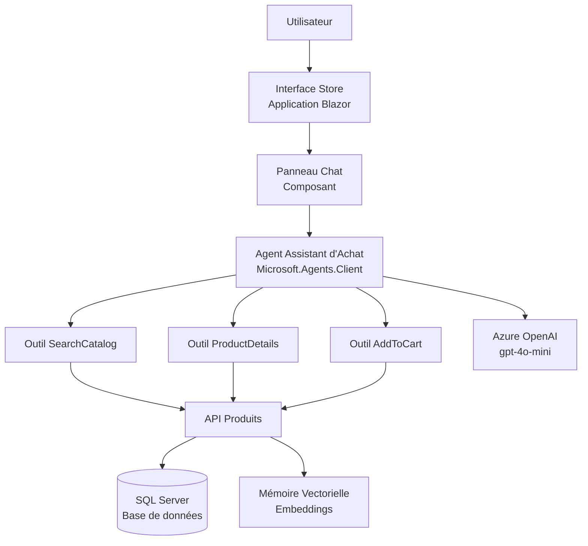
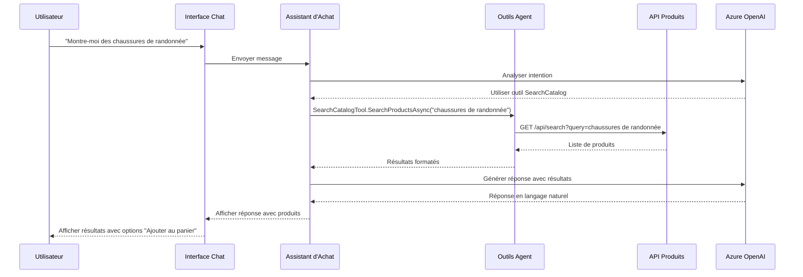

# Scénario 13 - Agent Assistant d'Achat avec Microsoft Agent Framework

## Description

Ce scénario démontre l'intégration du [Framework Agent de Microsoft](https://github.com/microsoft/agent-framework/) avec eShopLite pour créer un Agent Assistant d'Achat intelligent. L'agent aide les utilisateurs à découvrir des produits, obtenir des informations détaillées et gérer leur panier d'achat via des conversations en langage naturel.

L'Assistant d'Achat utilise des capacités d'IA avancées pour comprendre l'intention de l'utilisateur, rechercher dans le catalogue de produits, fournir des recommandations et aider avec l'ajout d'articles au panier - le tout via une interface conversationnelle.

## Fonctionnalités

- **Commerce Conversationnel:** Interaction en langage naturel pour la découverte de produits et les achats
- **Intégration Microsoft Agent Framework:** Utilise le SDK Microsoft.Agents.Client le plus récent pour l'orchestration d'agents
- **Recherche Intelligente de Produits:** Recherche de produits alimentée par l'IA avec compréhension sémantique
- **Recommandations de Produits:** Suggestions de produits contextuelles basées sur les requêtes utilisateur
- **Gestion du Panier:** Ajout de produits au panier via commandes conversationnelles
- **Agent Multi-Outils:** Trois outils spécialisés (SearchCatalog, ProductDetails, AddToCart)
- **Intégration Azure OpenAI:** Exploite les modèles GPT pour des réponses intelligentes
- **Chat en Temps Réel:** Interface de chat interactive avec réponses en streaming

## Référence

- [Microsoft Agent Framework](https://github.com/microsoft/agent-framework/)
- [Package NuGet Microsoft.Agents.Client](https://www.nuget.org/packages/Microsoft.Agents.Client/)

## Démarrage

La solution se trouve dans le dossier `./src`, la solution principale est **[eShopLite-AgentFramework.sln](./src/eShopLite-AgentFramework.sln)**.

## Déploiement

Une fois que vous avez ouvert le projet dans [Codespaces](#github-codespaces), ou [localement](#exécution-locale), vous pouvez le déployer sur Azure.

Depuis une fenêtre Terminal, ouvrez le dossier avec le clone de ce dépôt et exécutez les commandes suivantes.

1. Se connecter à Azure :

    ```shell
    azd auth login
    ```

2. Provisionner et déployer toutes les ressources :

    ```shell
    azd up
    ```

    Il vous demandera de fournir un nom d'environnement `azd` (comme "eShopLite-AgentFramework"), de sélectionner un abonnement de votre compte Azure, et de sélectionner un [emplacement où les modèles nécessaires gpt-4o-mini et text-embedding-ada-002 sont disponibles](https://azure.microsoft.com/explore/global-infrastructure/products-by-region/?products=cognitive-services&regions=all) (comme "eastus2").

3. Lorsque `azd` a terminé le déploiement, vous verrez la liste des ressources créées dans Azure et un ensemble d'URI dans la sortie de commande.

4. Visitez l'URI **store**, et vous devriez voir l'**application eShop Lite** avec l'interface de chat Assistant d'Achat ! 🎉

***Note :** Les fichiers de déploiement sont situés dans le dossier `./src/eShopAppHost/infra/`. Ils sont générés par le projet `Aspire AppHost`.*

### GitHub CodeSpaces

- Créez un nouveau Codespace en utilisant le bouton `Code` en haut du dépôt.

- Le processus de création du Codespace peut prendre quelques minutes.

- Une fois le Codespace chargé, il devrait avoir toutes les exigences nécessaires pour déployer la solution.

### Exécution Locale

Pour exécuter le projet localement, vous devez vous assurer que les outils suivants sont installés :

- [.NET 8](https://dotnet.microsoft.com/downloads/)
- [Git](https://git-scm.com/downloads)
- [Azure Developer CLI (azd)](https://aka.ms/install-azd)
- [Visual Studio Code](https://code.visualstudio.com/Download) ou [Visual Studio](https://visualstudio.microsoft.com/downloads/)
  - Si vous utilisez Visual Studio Code, installez le [C# Dev Kit](https://marketplace.visualstudio.com/items?itemName=ms-dotnettools.csdevkit)
- Workload .NET Aspire ([guide de configuration](https://learn.microsoft.com/dotnet/aspire/fundamentals/setup-tooling?tabs=windows&pivots=visual-studio#install-net-aspire))

### Exécuter la solution

Suivez ces étapes pour exécuter le projet, localement ou dans CodeSpaces :

1. Naviguez vers le dossier du projet Aspire Host en utilisant la commande :

   ```bash
   cd scenarios/13-AgentFramework/src/eShopAppHost/
   ```

2. Si vous exécutez le projet dans Codespaces, vous devez exécuter cette commande :

   ```bash
   dotnet dev-certs https --trust
   ```

3. Par défaut, le projet AppHost crée les ressources nécessaires sur Azure. Consultez la section **[Création de ressources Azure .NET Aspire](#création-de-ressources-azure-net-aspire)** pour apprendre comment configurer le projet pour créer des ressources Azure.

4. Exécutez le projet :

   ```bash
   dotnet run
   ```

5. Ouvrez l'application Store et cherchez l'icône de chat pour commencer à interagir avec l'Assistant d'Achat.

### Création de Ressources Azure .NET Aspire

Cette démo utilise Azure OpenAI pour les capacités d'IA de l'agent. Par défaut, lors de l'exécution de `azd up` ou du déploiement via Visual Studio/VS Code, les ressources Azure OpenAI nécessaires seront provisionnées automatiquement.

Pour le développement local, vous pouvez soit :

- Utiliser des ressources Azure OpenAI existantes en définissant la chaîne de connexion dans les secrets utilisateur
- Permettre à Aspire de provisionner les ressources lors du premier lancement

#### Développement local avec Azure OpenAI existant

Si vous avez des ressources Azure OpenAI existantes, vous pouvez les configurer en utilisant les secrets utilisateur :

```bash
cd scenarios/13-AgentFramework/src/ShoppingAssistantAgent
dotnet user-secrets set "OpenAI:Endpoint" "https://votre-ressource-openai.openai.azure.com/"
dotnet user-secrets set "OpenAI:ApiKey" "votre-cle-api-ici"
dotnet user-secrets set "OpenAI:DeploymentName" "gpt-4o-mini"
```

### Télémétrie avec .NET Aspire et Azure Application Insights

.NET Aspire fournit une télémétrie et une surveillance intégrées. Lorsqu'il est déployé sur Azure, l'application s'intègre automatiquement avec Azure Application Insights pour une observabilité complète.

## Diagramme d'Architecture



### Composants

1. **Store (Frontend)** - Application web Blazor avec interface de chat intégrée
2. **Agent Assistant d'Achat** - Agent alimenté par l'IA utilisant Microsoft Agent Framework
   - **Outil SearchCatalog** - Recherche des produits dans le catalogue
   - **Outil ProductDetails** - Récupère des informations détaillées sur les produits
   - **Outil AddToCart** - Ajoute des produits au panier d'achat
3. **API Produits** - API backend principale pour les opérations produits
4. **SQL Server** - Base de données pour les données produits et commandes
5. **Azure OpenAI** - LLM pour la compréhension et la génération du langage naturel

## Flux d'Interaction de l'Agent



## Guide

### Coûts

Ce scénario utilise Azure OpenAI et SQL Server. Les coûts varieront en fonction de :

- Utilisation d'Azure OpenAI (modèle GPT-4o-mini)
- Taille et utilisation de l'instance SQL Server
- Transfert de données

Pour des estimations de coûts, utilisez le [Calculateur de Prix Azure](https://azure.microsoft.com/pricing/calculator/).

### Directives de Sécurité

- Les clés API et secrets sont gérés via Azure Key Vault lors du déploiement
- CORS est configuré pour les requêtes cross-origin sécurisées
- La validation des entrées est appliquée à tous les points de terminaison de l'agent
- Le filtrage de contenu est activé pour les entrées utilisateur
- La limitation de débit protège contre les abus

## Ressources Supplémentaires

- [Documentation .NET Aspire](https://learn.microsoft.com/dotnet/aspire/)
- [Service Azure OpenAI](https://learn.microsoft.com/azure/cognitive-services/openai/)
- [Microsoft Agent Framework GitHub](https://github.com/microsoft/agent-framework/)
- [Meilleures Pratiques pour Construire des Agents IA](https://learn.microsoft.com/azure/architecture/ai-ml/guide/intelligent-agent-platform)
