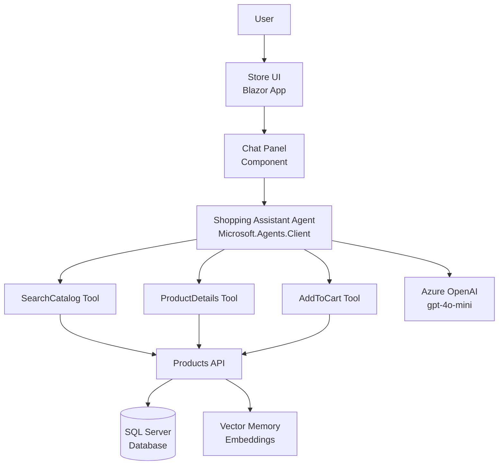
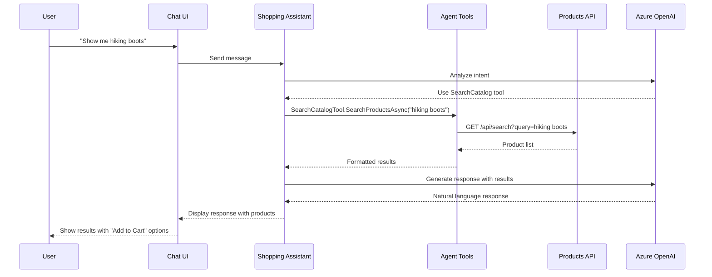

# Scenario 13 - Shopping Assistant Agent with Microsoft Agent Framework

## Description

This scenario demonstrates the integration of [Microsoft's Agent Framework](https://github.com/microsoft/agent-framework/) with eShopLite to create an intelligent Shopping Assistant Agent. The agent helps users discover products, get detailed information, and manage their shopping cart through natural language conversations.

The Shopping Assistant uses advanced AI capabilities to understand user intent, search the product catalog, provide recommendations, and assist with adding items to the cart - all through a conversational interface.

## Features

- **Conversational Commerce:** Natural language interaction for product discovery and shopping
- **Microsoft Agent Framework Integration:** Uses the latest Microsoft.Agents.Client SDK for agent orchestration
- **Intelligent Product Search:** AI-powered product search with semantic understanding
- **Product Recommendations:** Contextual product suggestions based on user queries
- **Cart Management:** Add products to cart through conversational commands
- **Multi-Tool Agent:** Three specialized tools (SearchCatalog, ProductDetails, AddToCart)
- **Azure OpenAI Integration:** Leverages GPT models for intelligent responses
- **Real-time Chat:** Interactive chat interface with streaming responses

## Reference

- [Microsoft Agent Framework](https://github.com/microsoft/agent-framework/)
- [Microsoft.Agents.Client NuGet Package](https://www.nuget.org/packages/Microsoft.Agents.Client/)

## Getting Started

The solution is in the `./src` folder, the main solution is **[eShopLite-AgentFramework.sln](./src/eShopLite-AgentFramework.sln)**.

## Deploying

Once you've opened the project in [Codespaces](#github-codespaces), or [locally](#run-locally), you can deploy it to Azure.

From a Terminal window, open the folder with the clone of this repo and run the following commands.

1. Login to Azure:

    ```shell
    azd auth login
    ```

1. Provision and deploy all the resources:

    ```shell
    azd up
    ```

    It will prompt you to provide an `azd` environment name (like "eShopLite-AgentFramework"), select a subscription from your Azure account, and select a [location where the necessary models gpt-4o-mini and text-embedding-ada-002 are available](https://azure.microsoft.com/explore/global-infrastructure/products-by-region/?products=cognitive-services&regions=all) (like "eastus2").

1. When `azd` has finished deploying, you'll see the list of resources created in Azure and a set of URIs in the command output.

1. Visit the **store** URI, and you should see the **eShop Lite app** with the Shopping Assistant chat interface! 🎉

***Note:** The deploy files are located in the `./src/eShopAppHost/infra/` folder. They are generated by the `Aspire AppHost` project.*

### GitHub CodeSpaces

- Create a new Codespace using the `Code` button at the top of the repository.

- The Codespace creation process can take a couple of minutes.

- Once the Codespace is loaded, it should have all the necessary requirements to deploy the solution.

### Run Locally

To run the project locally, you'll need to make sure the following tools are installed:

- [.NET 8](https://dotnet.microsoft.com/downloads/)
- [Git](https://git-scm.com/downloads)
- [Azure Developer CLI (azd)](https://aka.ms/install-azd)
- [Visual Studio Code](https://code.visualstudio.com/Download) or [Visual Studio](https://visualstudio.microsoft.com/downloads/)
  - If using Visual Studio Code, install the [C# Dev Kit](https://marketplace.visualstudio.com/items?itemName=ms-dotnettools.csdevkit)
- .NET Aspire workload ([setup guide](https://learn.microsoft.com/dotnet/aspire/fundamentals/setup-tooling?tabs=windows&pivots=visual-studio#install-net-aspire))

### Run the solution

Follow these steps to run the project, locally or in CodeSpaces:

1. Navigate to the Aspire Host folder project using the command:

   ```bash
   cd scenarios/13-AgentFramework/src/eShopAppHost/
   ```

2. If you are running the project in Codespaces, you need to run this command:

   ```bash
   dotnet dev-certs https --trust
   ```

3. By default the AppHost project creates the necessary resources on Azure. Check the **[.NET Aspire Azure Resources creation](#net-aspire-azure-resources-creation)** section to learn how to configure the project to create Azure resources.

4. Run the project:

   ```bash
   dotnet run
   ```

5. Open the Store application and look for the chat icon to start interacting with the Shopping Assistant.

### .NET Aspire Azure Resources creation

This demo uses Azure OpenAI for the agent's AI capabilities. By default, when running `azd up` or deploying through Visual Studio/VS Code, the necessary Azure OpenAI resources will be provisioned automatically.

For local development, you can either:

- Use existing Azure OpenAI resources by setting the connection string in user secrets
- Allow Aspire to provision resources during first run

#### Local development using existing Azure OpenAI

If you have existing Azure OpenAI resources, you can configure them using user secrets:

```bash
cd scenarios/13-AgentFramework/src/ShoppingAssistantAgent
dotnet user-secrets set "OpenAI:Endpoint" "https://your-openai-resource.openai.azure.com/"
dotnet user-secrets set "OpenAI:ApiKey" "your-api-key-here"
dotnet user-secrets set "OpenAI:DeploymentName" "gpt-4o-mini"
```

### Telemetry with .NET Aspire and Azure Application Insights

.NET Aspire provides built-in telemetry and monitoring. When deployed to Azure, the application automatically integrates with Azure Application Insights for comprehensive observability.

## Architecture Diagram



### Components

1. **Store (Frontend)** - Blazor web application with integrated chat interface
2. **Shopping Assistant Agent** - AI-powered agent using Microsoft Agent Framework
   - **SearchCatalog Tool** - Searches products in the catalog
   - **ProductDetails Tool** - Retrieves detailed product information
   - **AddToCart Tool** - Adds products to the shopping cart
3. **Products API** - Main backend API for product operations
4. **SQL Server** - Database for product and order data
5. **Azure OpenAI** - LLM for natural language understanding and generation

## Agent Interaction Flow



## Guidance

### Costs

This scenario uses Azure OpenAI and SQL Server. The costs will vary depending on:

- Azure OpenAI usage (GPT-4o-mini model)
- SQL Server instance size and usage
- Data transfer

For cost estimates, use the [Azure Pricing Calculator](https://azure.microsoft.com/pricing/calculator/).

### Security Guidelines

- API keys and secrets are managed through Azure Key Vault when deployed
- CORS is configured for secure cross-origin requests
- Input validation is applied to all agent endpoints
- Content filtering is enabled for user inputs
- Rate limiting protects against abuse

## Additional Resources

- [.NET Aspire Documentation](https://learn.microsoft.com/dotnet/aspire/)
- [Azure OpenAI Service](https://learn.microsoft.com/azure/cognitive-services/openai/)
- [Microsoft Agent Framework GitHub](https://github.com/microsoft/agent-framework/)
- [Building AI Agents Best Practices](https://learn.microsoft.com/azure/architecture/ai-ml/guide/intelligent-agent-platform)
