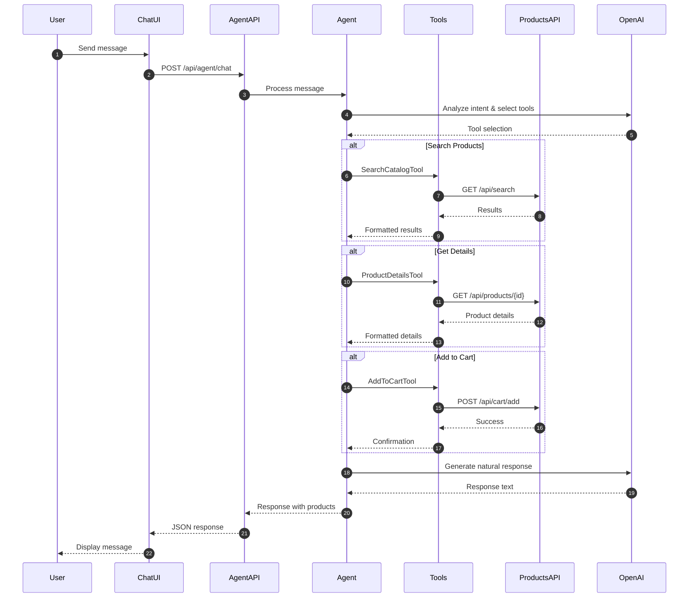
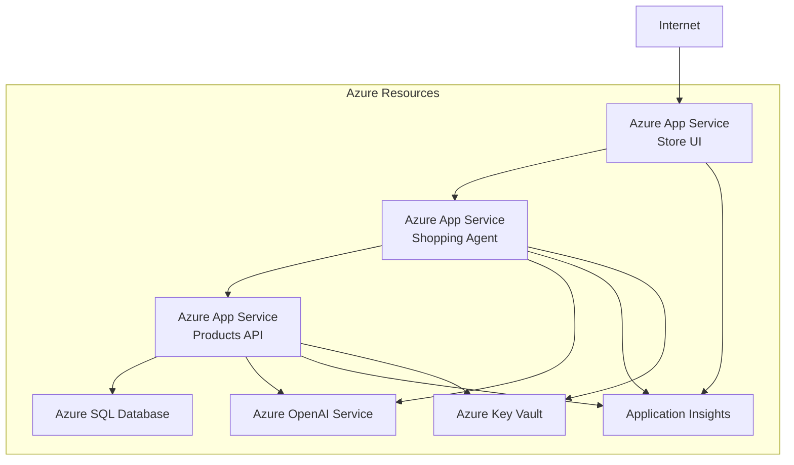

# Shopping Assistant Agent - Architecture

## System Architecture

The Shopping Assistant Agent is built on a modular architecture that separates concerns and enables scalability and maintainability.

### High-Level Architecture

```mermaid
graph TB
    subgraph "Frontend Layer"
        UI[Store Blazor UI]
        Chat[Chat Panel Component]
    end
    
    subgraph "Agent Layer"
        Agent[Shopping Assistant Agent]
        SearchTool[SearchCatalog Tool]
        DetailsTool[ProductDetails Tool]
        CartTool[AddToCart Tool]
    end
    
    subgraph "API Layer"
        ProductsAPI[Products API]
        AgentEndpoint[/api/agent/chat]
    end
    
    subgraph "Data Layer"
        SQL[(SQL Server)]
        Vector[(Vector Memory)]
    end
    
    subgraph "AI Services"
        OpenAI[Azure OpenAI<br/>gpt-4o-mini]
        Embeddings[Text Embeddings]
    end
    
    UI --> Chat
    Chat --> AgentEndpoint
    AgentEndpoint --> Agent
    Agent --> SearchTool
    Agent --> DetailsTool
    Agent --> CartTool
    SearchTool --> ProductsAPI
    DetailsTool --> ProductsAPI
    CartTool --> ProductsAPI
    ProductsAPI --> SQL
    ProductsAPI --> Vector
    Agent --> OpenAI
    Vector --> Embeddings
```

## Component Details

### 1. Store UI (Frontend)

**Technology:** Blazor Server

The Store UI is the user-facing application that includes:

- **Main Store Pages:** Product listing, search, cart, checkout
- **Chat Panel Component:** Interactive chat interface for the Shopping Assistant
- **Real-time Updates:** SignalR for real-time message streaming

**Key Files:**
- `Store/Components/Pages/ChatPanel.razor` - Chat UI component
- `Store/wwwroot/chat.js` - JavaScript for chat interactions
- `Store/Services/ChatService.cs` - Service for agent communication

### 2. Shopping Assistant Agent

**Technology:** ASP.NET Core Web API + Microsoft.Agents.Client

The agent service handles:

- Natural language processing and intent recognition
- Tool orchestration and execution
- Conversation context management
- Response generation

**Key Components:**

```csharp
// Agent Tools
- SearchCatalogTool    // Product search functionality
- ProductDetailsTool   // Product information retrieval
- AddToCartTool        // Cart management operations
```

**API Endpoints:**

| Endpoint | Method | Description |
|----------|--------|-------------|
| `/api/agent/chat` | POST | Main chat endpoint for agent interactions |
| `/health` | GET | Health check endpoint |

### 3. Agent Tools

Each tool is a specialized component that performs specific operations:

#### SearchCatalog Tool

```csharp
[Description("Search for products in the catalog by name or description")]
public async Task<string> SearchProductsAsync(string query)
```

**Responsibilities:**
- Query the Products API search endpoint
- Format results for the agent
- Handle search errors gracefully

#### ProductDetails Tool

```csharp
[Description("Get detailed information about a specific product by its ID")]
public async Task<string> GetProductDetailsAsync(string productId)
```

**Responsibilities:**
- Retrieve product details from the API
- Format product information
- Handle product not found scenarios

#### AddToCart Tool

```csharp
[Description("Add a product to the shopping cart")]
public async Task<string> AddProductToCartAsync(string productId, int quantity = 1)
```

**Responsibilities:**
- Validate product existence
- Add items to the user's cart
- Confirm successful additions

### 4. Products API

**Technology:** ASP.NET Core Web API

The Products API provides backend services for:

- Product CRUD operations
- Search functionality (keyword and semantic)
- Cart management
- Order processing

**Key Endpoints:**

| Endpoint | Method | Description |
|----------|--------|-------------|
| `/api/products` | GET | List all products |
| `/api/products/{id}` | GET | Get product by ID |
| `/api/search` | GET | Search products |
| `/api/cart/add` | POST | Add to cart |

### 5. Data Layer

#### SQL Server

Stores:
- Product catalog
- User data
- Shopping carts
- Orders and order history

#### Vector Memory

Stores product embeddings for semantic search using:
- In-memory vector store (development)
- Azure AI Search (production)

### 6. AI Services

#### Azure OpenAI

**Model:** gpt-4o-mini

**Responsibilities:**
- Natural language understanding
- Intent classification
- Response generation
- Tool selection and orchestration

**Configuration:**
```json
{
  "OpenAI": {
    "Endpoint": "https://your-openai.openai.azure.com/",
    "DeploymentName": "gpt-4o-mini"
  }
}
```

#### Text Embeddings

**Model:** text-embedding-ada-002

**Usage:**
- Product description embeddings
- Semantic search capabilities
- Similar product recommendations

## Data Flow

### User Message Processing Flow



## Deployment Architecture

### Local Development

```
┌─────────────────────────────────────┐
│  .NET Aspire AppHost                │
├─────────────────────────────────────┤
│  ┌──────────────────────────────┐   │
│  │ Shopping Assistant Agent     │   │
│  └──────────────────────────────┘   │
│  ┌──────────────────────────────┐   │
│  │ Products API                 │   │
│  └──────────────────────────────┘   │
│  ┌──────────────────────────────┐   │
│  │ Store UI                     │   │
│  └──────────────────────────────┘   │
│  ┌──────────────────────────────┐   │
│  │ SQL Server (Container)       │   │
│  └──────────────────────────────┘   │
└─────────────────────────────────────┘
```

### Azure Production



## Configuration Management

### Environment Variables

| Variable | Description | Required |
|----------|-------------|----------|
| `OpenAI:Endpoint` | Azure OpenAI endpoint URL | Yes |
| `OpenAI:ApiKey` | Azure OpenAI API key | Yes (or use managed identity) |
| `OpenAI:DeploymentName` | Model deployment name | Yes |
| `ConnectionStrings:sqldb` | SQL Server connection string | Yes |

### Secrets Management

- **Local Development:** User secrets (`dotnet user-secrets`)
- **Azure:** Azure Key Vault with managed identity

### Aspire Configuration

The eShopAppHost orchestrates all services:

```csharp
var builder = DistributedApplication.CreateBuilder(args);

// Add SQL Database
var sqldb = builder.AddSqlServer("sql")
    .WithDataVolume()
    .AddDatabase("sqldb");

// Add Shopping Assistant Agent
var shoppingAgent = builder.AddProject<Projects.ShoppingAssistantAgent>("shopping-agent");

// Add Products API
var products = builder.AddProject<Projects.Products>("products")
    .WithReference(sqldb)
    .WithReference(shoppingAgent);

// Add Store UI
var store = builder.AddProject<Projects.Store>("store")
    .WithReference(products)
    .WithReference(shoppingAgent);
```

## Scalability Considerations

1. **Horizontal Scaling:** Each service can scale independently
2. **Caching:** Product data and embeddings are cached
3. **Async Operations:** All agent operations are asynchronous
4. **Connection Pooling:** Database connections are pooled
5. **Rate Limiting:** Protects against abuse and manages costs

## Security Architecture

- **HTTPS Everywhere:** All communication encrypted
- **API Key Management:** Keys stored in Key Vault
- **CORS Configuration:** Restricted to known origins
- **Input Validation:** All user inputs validated
- **Content Filtering:** Azure OpenAI content filters enabled
- **Authentication:** Ready for authentication integration

## Monitoring and Observability

- **Application Insights:** Centralized logging and metrics
- **Aspire Dashboard:** Real-time service health
- **Custom Telemetry:** Agent interaction tracking
- **Performance Metrics:** Response times and token usage
