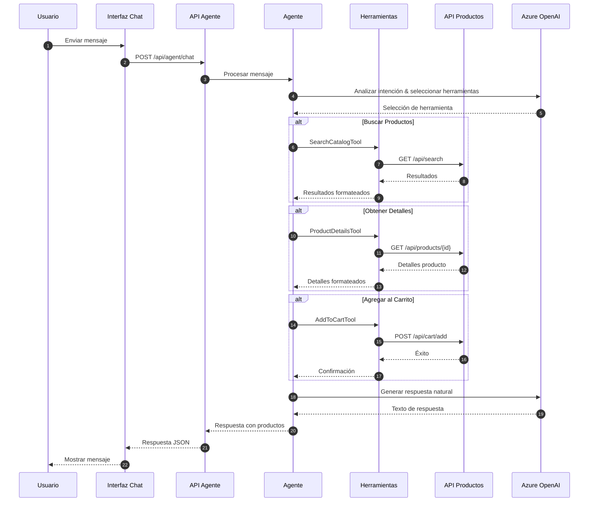
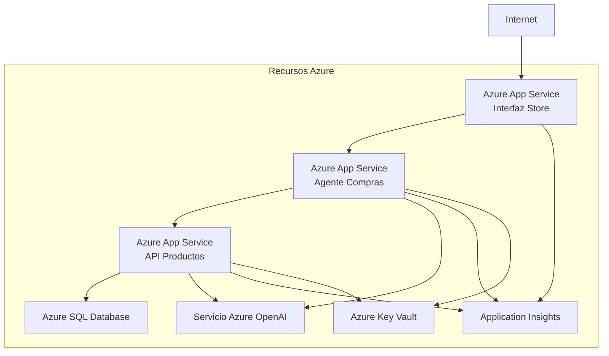

# Agente Asistente de Compras - Arquitectura

## Arquitectura del Sistema

El Agente Asistente de Compras está construido sobre una arquitectura modular que separa las preocupaciones y permite escalabilidad y mantenibilidad.

### Arquitectura de Alto Nivel

```mermaid
graph TB
    subgraph "Capa Frontend"
        UI[Interfaz Blazor Store]
        Chat[Componente Panel Chat]
    end
    
    subgraph "Capa Agente"
        Agent[Agente Asistente de Compras]
        SearchTool[Herramienta SearchCatalog]
        DetailsTool[Herramienta ProductDetails]
        CartTool[Herramienta AddToCart]
    end
    
    subgraph "Capa API"
        ProductsAPI[API Productos]
        AgentEndpoint[/api/agent/chat]
    end
    
    subgraph "Capa Datos"
        SQL[(SQL Server)]
        Vector[(Memoria Vectorial)]
    end
    
    subgraph "Servicios IA"
        OpenAI[Azure OpenAI<br/>gpt-4o-mini]
        Embeddings[Embeddings Texto]
    end
    
    UI --> Chat
    Chat --> AgentEndpoint
    AgentEndpoint --> Agent
    Agent --> SearchTool
    Agent --> DetailsTool
    Agent --> CartTool
    SearchTool --> ProductsAPI
    DetailsTool --> ProductsAPI
    CartTool --> ProductsAPI
    ProductsAPI --> SQL
    ProductsAPI --> Vector
    Agent --> OpenAI
    Vector --> Embeddings
```

## Detalles de Componentes

### 1. Interfaz Store (Frontend)

**Tecnología:** Blazor Server

La interfaz Store es la aplicación orientada al usuario que incluye:

- **Páginas Store Principales:** Listado de productos, búsqueda, carrito, pago
- **Componente Panel Chat:** Interfaz de chat interactiva para el Asistente de Compras
- **Actualizaciones en Tiempo Real:** SignalR para streaming de mensajes en tiempo real

**Archivos Clave:**
- `Store/Components/Pages/ChatPanel.razor` - Componente de interfaz de chat
- `Store/wwwroot/chat.js` - JavaScript para interacciones de chat
- `Store/Services/ChatService.cs` - Servicio para comunicación con el agente

### 2. Agente Asistente de Compras

**Tecnología:** API Web ASP.NET Core + Microsoft.Agents.Client

El servicio de agente maneja:

- Procesamiento de lenguaje natural y reconocimiento de intención
- Orquestación y ejecución de herramientas
- Gestión del contexto de conversación
- Generación de respuestas

**Componentes Clave:**

```csharp
// Herramientas del Agente
- SearchCatalogTool    // Funcionalidad de búsqueda de productos
- ProductDetailsTool   // Recuperación de información de producto
- AddToCartTool        // Operaciones de gestión del carrito
```

**Puntos de Acceso API:**

| Punto de Acceso | Método | Descripción |
|----------|--------|-------------|
| `/api/agent/chat` | POST | Punto de acceso de chat principal para interacciones con el agente |
| `/health` | GET | Punto de acceso de verificación de salud |

### 3. Herramientas del Agente

Cada herramienta es un componente especializado que realiza operaciones específicas:

#### Herramienta SearchCatalog

```csharp
[Description("Buscar productos en el catálogo por nombre o descripción")]
public async Task<string> SearchProductsAsync(string query)
```

**Responsabilidades:**
- Consultar el punto de acceso de búsqueda de la API Productos
- Formatear resultados para el agente
- Manejar errores de búsqueda con gracia

#### Herramienta ProductDetails

```csharp
[Description("Obtener información detallada sobre un producto específico por su ID")]
public async Task<string> GetProductDetailsAsync(string productId)
```

**Responsabilidades:**
- Recuperar detalles del producto desde la API
- Formatear información del producto
- Manejar escenarios de producto no encontrado

#### Herramienta AddToCart

```csharp
[Description("Agregar un producto al carrito de compras")]
public async Task<string> AddProductToCartAsync(string productId, int quantity = 1)
```

**Responsabilidades:**
- Validar la existencia del producto
- Agregar artículos al carrito del usuario
- Confirmar adiciones exitosas

### 4. API Productos

**Tecnología:** API Web ASP.NET Core

La API Productos proporciona servicios backend para:

- Operaciones CRUD de productos
- Funcionalidad de búsqueda (por palabras clave y semántica)
- Gestión del carrito
- Procesamiento de pedidos

**Puntos de Acceso Clave:**

| Punto de Acceso | Método | Descripción |
|----------|--------|-------------|
| `/api/products` | GET | Lista todos los productos |
| `/api/products/{id}` | GET | Obtener producto por ID |
| `/api/search` | GET | Buscar productos |
| `/api/cart/add` | POST | Agregar al carrito |

### 5. Capa de Datos

#### SQL Server

Almacena:
- Catálogo de productos
- Datos de usuario
- Carritos de compras
- Pedidos e historial de pedidos

#### Memoria Vectorial

Almacena embeddings de productos para búsqueda semántica usando:
- Almacén vectorial en memoria (desarrollo)
- Azure AI Search (producción)

### 6. Servicios IA

#### Azure OpenAI

**Modelo:** gpt-4o-mini

**Responsabilidades:**
- Comprensión del lenguaje natural
- Clasificación de intención
- Generación de respuestas
- Selección y orquestación de herramientas

**Configuración:**
```json
{
  "OpenAI": {
    "Endpoint": "https://tu-openai.openai.azure.com/",
    "DeploymentName": "gpt-4o-mini"
  }
}
```

#### Embeddings de Texto

**Modelo:** text-embedding-ada-002

**Uso:**
- Embeddings de descripción de producto
- Capacidades de búsqueda semántica
- Recomendaciones de productos similares

## Flujo de Datos

### Flujo de Procesamiento de Mensajes de Usuario



## Arquitectura de Implementación

### Desarrollo Local

```
┌─────────────────────────────────────┐
│  .NET Aspire AppHost                │
├─────────────────────────────────────┤
│  ┌──────────────────────────────┐   │
│  │ Agente Asistente de Compras  │   │
│  └──────────────────────────────┘   │
│  ┌──────────────────────────────┐   │
│  │ API Productos                │   │
│  └──────────────────────────────┘   │
│  ┌──────────────────────────────┐   │
│  │ Interfaz Store               │   │
│  └──────────────────────────────┘   │
│  ┌──────────────────────────────┐   │
│  │ SQL Server (Contenedor)      │   │
│  └──────────────────────────────┘   │
└─────────────────────────────────────┘
```

### Producción Azure



## Gestión de Configuración

### Variables de Entorno

| Variable | Descripción | Requerido |
|----------|-------------|----------|
| `OpenAI:Endpoint` | URL del punto de acceso Azure OpenAI | Sí |
| `OpenAI:ApiKey` | Clave API Azure OpenAI | Sí (o usar identidad administrada) |
| `OpenAI:DeploymentName` | Nombre de implementación del modelo | Sí |
| `ConnectionStrings:sqldb` | Cadena de conexión SQL Server | Sí |

### Gestión de Secretos

- **Desarrollo Local:** Secretos de usuario (`dotnet user-secrets`)
- **Azure:** Azure Key Vault con identidad administrada

## Consideraciones de Escalabilidad

1. **Escalado Horizontal:** Cada servicio puede escalar independientemente
2. **Almacenamiento en Caché:** Los datos de productos y embeddings se almacenan en caché
3. **Operaciones Asíncronas:** Todas las operaciones del agente son asíncronas
4. **Agrupación de Conexiones:** Las conexiones de base de datos se agrupan
5. **Limitación de Tasa:** Protege contra abusos y gestiona costos

## Arquitectura de Seguridad

- **HTTPS en Todas Partes:** Toda comunicación cifrada
- **Gestión de Claves API:** Claves almacenadas en Key Vault
- **Configuración CORS:** Restringido a orígenes conocidos
- **Validación de Entradas:** Todas las entradas de usuario validadas
- **Filtrado de Contenido:** Filtros de contenido Azure OpenAI habilitados
- **Autenticación:** Listo para integración de autenticación

## Monitoreo y Observabilidad

- **Application Insights:** Registro y métricas centralizados
- **Panel Aspire:** Salud del servicio en tiempo real
- **Telemetría Personalizada:** Seguimiento de interacciones del agente
- **Métricas de Rendimiento:** Tiempos de respuesta y uso de tokens
