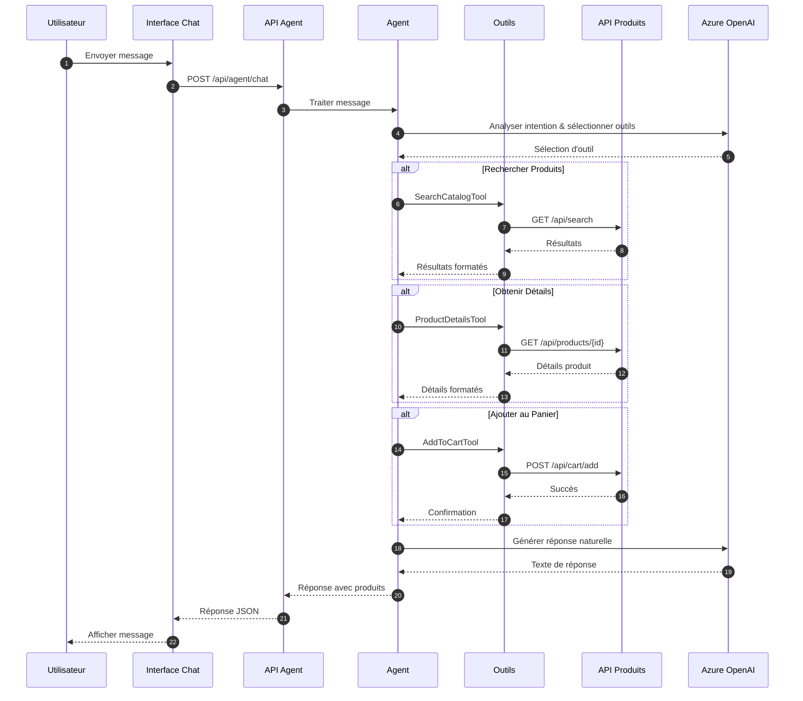
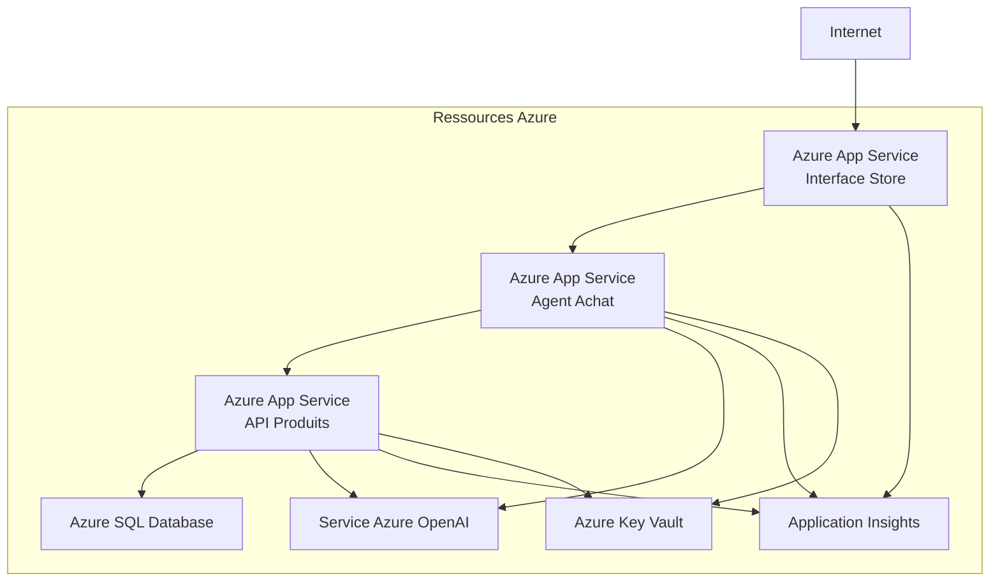

# Agent Assistant d'Achat - Architecture

## Architecture Système

L'Agent Assistant d'Achat est construit sur une architecture modulaire qui sépare les préoccupations et permet l'évolutivité et la maintenabilité.

### Architecture de Haut Niveau

```mermaid
graph TB
    subgraph "Couche Frontend"
        UI[Interface Blazor Store]
        Chat[Composant Panneau Chat]
    end
    
    subgraph "Couche Agent"
        Agent[Agent Assistant d'Achat]
        SearchTool[Outil SearchCatalog]
        DetailsTool[Outil ProductDetails]
        CartTool[Outil AddToCart]
    end
    
    subgraph "Couche API"
        ProductsAPI[API Produits]
        AgentEndpoint[/api/agent/chat]
    end
    
    subgraph "Couche Données"
        SQL[(SQL Server)]
        Vector[(Mémoire Vectorielle)]
    end
    
    subgraph "Services IA"
        OpenAI[Azure OpenAI<br/>gpt-4o-mini]
        Embeddings[Embeddings Texte]
    end
    
    UI --> Chat
    Chat --> AgentEndpoint
    AgentEndpoint --> Agent
    Agent --> SearchTool
    Agent --> DetailsTool
    Agent --> CartTool
    SearchTool --> ProductsAPI
    DetailsTool --> ProductsAPI
    CartTool --> ProductsAPI
    ProductsAPI --> SQL
    ProductsAPI --> Vector
    Agent --> OpenAI
    Vector --> Embeddings
```

## Détails des Composants

### 1. Interface Store (Frontend)

**Technologie:** Blazor Server

L'interface Store est l'application orientée utilisateur qui inclut :

- **Pages Store Principales:** Liste de produits, recherche, panier, paiement
- **Composant Panneau Chat:** Interface de chat interactive pour l'Assistant d'Achat
- **Mises à Jour en Temps Réel:** SignalR pour le streaming de messages en temps réel

**Fichiers Clés:**
- `Store/Components/Pages/ChatPanel.razor` - Composant d'interface de chat
- `Store/wwwroot/chat.js` - JavaScript pour les interactions de chat
- `Store/Services/ChatService.cs` - Service pour la communication avec l'agent

### 2. Agent Assistant d'Achat

**Technologie:** API Web ASP.NET Core + Microsoft.Agents.Client

Le service agent gère :

- Le traitement du langage naturel et la reconnaissance d'intention
- L'orchestration et l'exécution d'outils
- La gestion du contexte de conversation
- La génération de réponses

**Composants Clés:**

```csharp
// Outils Agent
- SearchCatalogTool    // Fonctionnalité de recherche de produits
- ProductDetailsTool   // Récupération d'informations produit
- AddToCartTool        // Opérations de gestion du panier
```

**Points de Terminaison API:**

| Point de Terminaison | Méthode | Description |
|----------|--------|-------------|
| `/api/agent/chat` | POST | Point de terminaison de chat principal pour les interactions avec l'agent |
| `/health` | GET | Point de terminaison de vérification de santé |

### 3. Outils Agent

Chaque outil est un composant spécialisé qui effectue des opérations spécifiques :

#### Outil SearchCatalog

```csharp
[Description("Rechercher des produits dans le catalogue par nom ou description")]
public async Task<string> SearchProductsAsync(string query)
```

**Responsabilités:**
- Interroger le point de terminaison de recherche de l'API Produits
- Formater les résultats pour l'agent
- Gérer les erreurs de recherche avec élégance

#### Outil ProductDetails

```csharp
[Description("Obtenir des informations détaillées sur un produit spécifique par son ID")]
public async Task<string> GetProductDetailsAsync(string productId)
```

**Responsabilités:**
- Récupérer les détails du produit depuis l'API
- Formater les informations produit
- Gérer les scénarios de produit non trouvé

#### Outil AddToCart

```csharp
[Description("Ajouter un produit au panier d'achat")]
public async Task<string> AddProductToCartAsync(string productId, int quantity = 1)
```

**Responsabilités:**
- Valider l'existence du produit
- Ajouter des articles au panier de l'utilisateur
- Confirmer les ajouts réussis

### 4. API Produits

**Technologie:** API Web ASP.NET Core

L'API Produits fournit des services backend pour :

- Opérations CRUD produits
- Fonctionnalité de recherche (par mots-clés et sémantique)
- Gestion du panier
- Traitement des commandes

**Points de Terminaison Clés:**

| Point de Terminaison | Méthode | Description |
|----------|--------|-------------|
| `/api/products` | GET | Liste tous les produits |
| `/api/products/{id}` | GET | Obtenir un produit par ID |
| `/api/search` | GET | Rechercher des produits |
| `/api/cart/add` | POST | Ajouter au panier |

### 5. Couche Données

#### SQL Server

Stocke :
- Catalogue de produits
- Données utilisateur
- Paniers d'achat
- Commandes et historique des commandes

#### Mémoire Vectorielle

Stocke les embeddings de produits pour la recherche sémantique en utilisant :
- Magasin vectoriel en mémoire (développement)
- Azure AI Search (production)

### 6. Services IA

#### Azure OpenAI

**Modèle:** gpt-4o-mini

**Responsabilités:**
- Compréhension du langage naturel
- Classification d'intention
- Génération de réponses
- Sélection et orchestration d'outils

**Configuration:**
```json
{
  "OpenAI": {
    "Endpoint": "https://votre-openai.openai.azure.com/",
    "DeploymentName": "gpt-4o-mini"
  }
}
```

#### Embeddings Texte

**Modèle:** text-embedding-ada-002

**Usage:**
- Embeddings de description de produit
- Capacités de recherche sémantique
- Recommandations de produits similaires

## Flux de Données

### Flux de Traitement des Messages Utilisateur



## Architecture de Déploiement

### Développement Local

```
┌─────────────────────────────────────┐
│  .NET Aspire AppHost                │
├─────────────────────────────────────┤
│  ┌──────────────────────────────┐   │
│  │ Agent Assistant d'Achat      │   │
│  └──────────────────────────────┘   │
│  ┌──────────────────────────────┐   │
│  │ API Produits                 │   │
│  └──────────────────────────────┘   │
│  ┌──────────────────────────────┐   │
│  │ Interface Store              │   │
│  └──────────────────────────────┘   │
│  ┌──────────────────────────────┐   │
│  │ SQL Server (Conteneur)       │   │
│  └──────────────────────────────┘   │
└─────────────────────────────────────┘
```

### Production Azure



## Gestion de Configuration

### Variables d'Environnement

| Variable | Description | Requis |
|----------|-------------|----------|
| `OpenAI:Endpoint` | URL du point de terminaison Azure OpenAI | Oui |
| `OpenAI:ApiKey` | Clé API Azure OpenAI | Oui (ou utiliser identité gérée) |
| `OpenAI:DeploymentName` | Nom du déploiement du modèle | Oui |
| `ConnectionStrings:sqldb` | Chaîne de connexion SQL Server | Oui |

### Gestion des Secrets

- **Développement Local:** Secrets utilisateur (`dotnet user-secrets`)
- **Azure:** Azure Key Vault avec identité gérée

## Considérations d'Évolutivité

1. **Mise à l'Échelle Horizontale:** Chaque service peut évoluer indépendamment
2. **Mise en Cache:** Les données produits et embeddings sont mises en cache
3. **Opérations Asynchrones:** Toutes les opérations agent sont asynchrones
4. **Pool de Connexions:** Les connexions base de données sont regroupées
5. **Limitation de Débit:** Protège contre les abus et gère les coûts

## Architecture de Sécurité

- **HTTPS Partout:** Toute communication chiffrée
- **Gestion des Clés API:** Clés stockées dans Key Vault
- **Configuration CORS:** Restreint aux origines connues
- **Validation des Entrées:** Toutes les entrées utilisateur validées
- **Filtrage du Contenu:** Filtres de contenu Azure OpenAI activés
- **Authentification:** Prêt pour l'intégration d'authentification

## Surveillance et Observabilité

- **Application Insights:** Journalisation et métriques centralisées
- **Tableau de Bord Aspire:** Santé du service en temps réel
- **Télémétrie Personnalisée:** Suivi des interactions agent
- **Métriques de Performance:** Temps de réponse et utilisation de tokens
