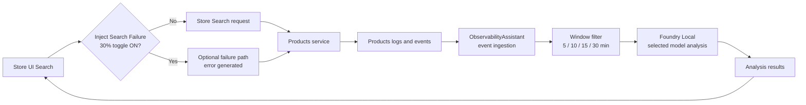

# Observability Assistant with Foundry Local

## Scenario focus

Local-first observability flow for Demo 1 in the modernization session.

## Demo 1 narrative (presenter-facing)

- Aspire services: `products`, `store`, `observabilityassistant`.
- User triggers analysis from Store.
- Store calls `observabilityassistant` backend.
- Backend analyzes **real ingested observability events** (no synthetic `BuildLogs`) and Store displays findings.
- Foundry Local model is selected by config using `FoundryLocal:SelectedModel` + `FoundryLocal:Models` catalog.
- Search page includes a default-on toggle: **Inject Search Failure (30%)** to intentionally generate telemetry errors.
- Presenter runs window analysis in sequence: **5 / 10 / 15 / 30 minutes**.

## Log-analysis flow (local models)

## Scope

- Local runnable sample first.
- Foundry Local is primary path; Azure/OpenAI provider swaps are optional.

## Session docs
See the shared session package at [docs/26 06 16 NET Agentic Modernization](../../docs/26%2006%2016%20NET%20Agentic%20Modernization/README.md).
