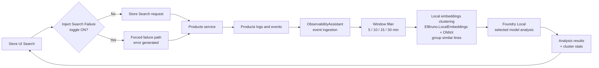

# Observability Assistant with Foundry Local

## Scenario focus

Local-first observability flow for Demo 1 in the modernization session.

## Demo 1 narrative (presenter-facing)

- Aspire services: `products`, `store`, `observabilityassistant`.
- User triggers analysis from Store.
- Store calls `observabilityassistant` backend.
- Backend analyzes **real ingested observability events** (no synthetic `BuildLogs`) and Store displays findings.
- Foundry Local model is selected by config using `FoundryLocal:SelectedModel` + `FoundryLocal:Models` catalog (demo default key `phi3-5-mini` -> alias `phi-3.5-mini`; `phi4-mini`, `phi4`, and `qwen2-5-coder` are also in the catalog). The service warms the selected model on startup so the first **Analyze** is a fast inference.
- If the local model is unavailable, the page still returns a deterministic multi-section analysis and the **Backend call proof** card shows a **Why fallback** reason (and `Analysis source: fallback`); when the model answers it shows `Analysis source: foundry-local`.
- Search page includes a default-on toggle: **Inject Search Failure** to intentionally generate telemetry errors. When checked, every search forces an error in the Products service so the assistant has something to detect.
- Presenter runs window analysis in sequence: **5 / 10 / 15 / 30 minutes**.

## Log-analysis flow (local models)

The analysis pipeline runs **fully local**: Foundry Local serves the LLM and
[`ElBruno.LocalEmbeddings`](https://www.nuget.org/packages/ElBruno.LocalEmbeddings)
(ONNX Runtime) generates embeddings on-box. Before the model summarizes a window,
similar log lines are grouped by embedding cosine-similarity so the prompt carries
de-duplicated representatives with occurrence counts (`xN`) instead of raw noise.

Both local components are config-toggleable:

- **LLM model** — `FoundryLocal:SelectedModel` (+ `FoundryLocal:Models` catalog) in
  `src/ObservabilityAssistant/appsettings.json` (demo default `phi3-5-mini`). Switching
  models is a one-line change: point `SelectedModel` at another catalog key (make sure
  that model is downloaded/loadable) and restart. Inspect downloaded/loaded models with
  `foundry cache list` and `foundry service ps`; pre-load with `foundry model run phi-3.5-mini`.
- **Embeddings clustering** — the `Embeddings` section in the same file
  (`Enabled`, `ModelName`, `SimilarityThreshold`). Set `Enabled: false` to send raw
  log lines straight to the model (useful for a before/after demo). If the embedding
  model can't initialize, the analyzer degrades gracefully to pass-through.

## Scope

- Local runnable sample first.
- Foundry Local is primary path; Azure/OpenAI provider swaps are optional.

## Session docs
See the shared session package at [docs/26 06 16 NET Agentic Modernization](../../docs/26%2006%2016%20NET%20Agentic%20Modernization/README.md).
