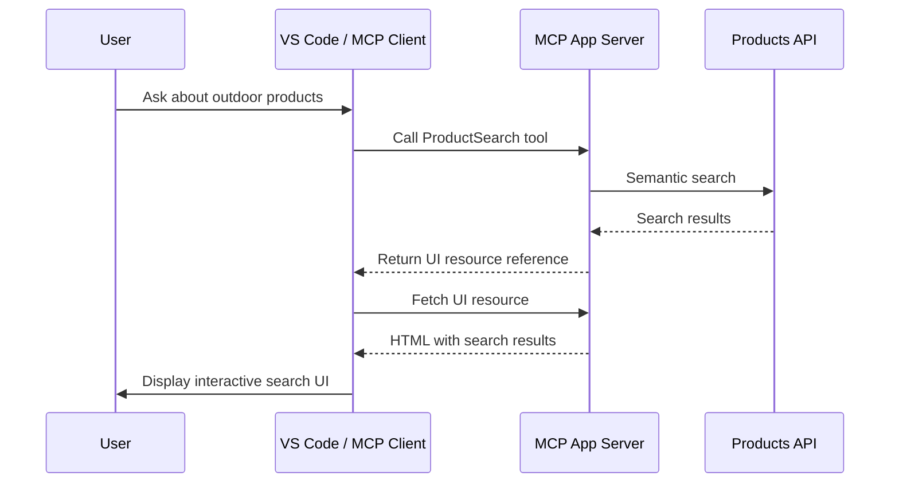
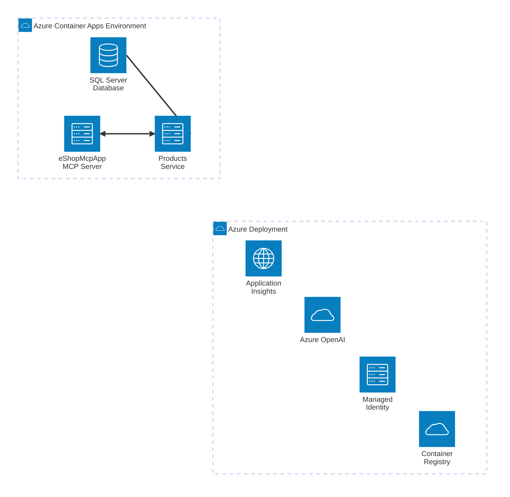

# eShopLite - MCP App with Semantic Search

[](/LICENSE)
[](https://dotnet.microsoft.com/)
[](https://modelcontextprotocol.github.io/ext-apps/api/)

## Description

**eShopLite - MCP App** is a reference .NET application demonstrating how to build a **Model Context Protocol (MCP) App** with an interactive search UI for the eShopLite product database. This scenario showcases the new MCP Apps extension that allows MCP servers to provide rich, interactive UI components to clients.

- [What are MCP Apps?](#what-are-mcp-apps)
- [Features](#features)
- [Architecture diagram](#architecture-diagram)
- [Getting started](#getting-started)
- [Deploying to Azure](#deploying)
- Run solution
  - [Run locally](#run-locally)
  - [Run the solution](#run-the-solution)
  - [.NET Aspire Azure Resources creation](#net-aspire-azure-resources-creation)
  - [Local development using an existing model](#local-development-using-an-existing-model)
  - [Telemetry with .NET Aspire and Azure Application Insights](#telemetry-with-net-aspire-and-azure-application-insights)
- [Resources](#resources)
- [Guidance](#guidance)
  - [Costs](#costs)
  - [Security Guidelines](#security-guidelines)

## What are MCP Apps?

**MCP Apps** are a new extension to the Model Context Protocol that allows MCP servers to provide interactive UI components. Unlike traditional MCP servers that only expose tools and resources as text or structured data, MCP Apps can serve rich HTML-based user interfaces that integrate directly into MCP-compatible clients like VS Code.

Key characteristics of MCP Apps:

1. **UI Resource Delivery**: MCP Apps can expose HTML content as resources that clients can render as embedded UIs
2. **Interactive Components**: The UI can include interactive elements like buttons, forms, and real-time updates
3. **VS Code Theme Integration**: UIs can automatically adapt to the user's VS Code theme using CSS variables
4. **Two-Way Communication**: The UI can communicate back to the host application using `postMessage`
5. **Tool + UI Pattern**: Tools can return references to UI resources, allowing LLMs to trigger UI interactions

### How MCP Apps Work



## Features

**GitHub CodeSpaces:** This project is designed to be opened in GitHub Codespaces as an easy way for anyone to deploy the solution entirely in the browser.

This scenario showcases the following key capabilities:

- **MCP App with Interactive UI**: Demonstrates how to create an MCP App that provides a rich search interface using the [MCP C# SDK](https://modelcontextprotocol.github.io/csharp-sdk/)
- **Semantic Product Search**: AI-powered search using embeddings to find relevant products based on meaning, not just keywords
- **VS Code Integration**: The search UI automatically adapts to VS Code themes and integrates with the MCP extension
- **HTTP Transport**: Easy integration with MCP clients using standard HTTP endpoints
- **Real-time Search Results**: Products are displayed with images, descriptions, and prices in an interactive grid

### MCP Tools Exposed

| Tool | Description |
|------|-------------|
| `ProductSearch` | Opens an interactive search UI to find products using semantic search |
| `SemanticSearchProducts` | Performs semantic search and returns product results programmatically |
| `KeywordSearchProducts` | Searches products by keyword matching in names |

## Architecture diagram



## Getting Started

The solution is in the `./src` folder, the main solution is **[eShopLite-Aspire-MCPApp.slnx](./src/eShopLite-Aspire-MCPApp.slnx)**.

## Deploying

Once you've opened the project in [Codespaces](#github-codespaces), or [locally](#run-locally), you can deploy it to Azure.

From a Terminal window, open the folder with the clone of this repo and run the following commands.

1. Login to Azure:

    ```shell
    azd auth login
    ```

2. Provision and deploy all the resources:

    ```shell
    azd up
    ```

    It will prompt you to provide an `azd` environment name (like "eShopLite-MCPApp"), select a subscription from your Azure account, and select a [location where the necessary models are available](https://azure.microsoft.com/explore/global-infrastructure/products-by-region/?products=cognitive-services&regions=all).

3. When `azd` has finished deploying, you'll see the list of resources created in Azure and a set of URIs in the command output.

4. Configure VS Code to use the deployed MCP App endpoint.

### GitHub CodeSpaces

- Create a new Codespace using the `Code` button at the top of the repository.

- The Codespace creation process can take a couple of minutes.

- Once the Codespace is loaded, it should have all the necessary requirements to deploy the solution.

### Run Locally

To run the project locally, you'll need to make sure the following tools are installed:

- [.NET 10](https://dotnet.microsoft.com/downloads/)
- [Git](https://git-scm.com/downloads)
- [Azure Developer CLI (azd)](https://aka.ms/install-azd)
- [Visual Studio Code](https://code.visualstudio.com/Download) with MCP extension
  - If using Visual Studio Code, install the [C# Dev Kit](https://marketplace.visualstudio.com/items?itemName=ms-dotnettools.csdevkit)
- An OCI compliant container runtime, such as:
  - [Docker Desktop](https://www.docker.com/products/docker-desktop/) or [Podman](https://podman.io/).

### Run the solution

Follow these steps to run the project, locally or in CodeSpaces:

1. Navigate to the Aspire Host folder project using the command:

   ```bash
   cd ./src/eShopAppHost/
   ```

2. If you are running the project in Codespaces, you need to run this command:

   ```bash
   dotnet dev-certs https --trust
   ```

3. By default the AppHost project creates the necessary resources on Azure. Check the **[.NET Aspire Azure Resources creation](#net-aspire-azure-resources-creation)** section to learn how to configure the project to create Azure resources.

4. Run the project:

   ```bash
   dotnet run
   ```

5. Configure VS Code MCP extension:

   Add the following to your VS Code MCP configuration (`.vscode/mcp.json`):

   ```json
   {
     "servers": {
       "eshoplite-search": {
         "type": "http",
         "url": "http://localhost:5200/mcp"
       }
     }
   }
   ```

6. Use the `ProductSearch` tool in VS Code with the MCP extension to open the interactive search UI.

## Understanding MCP Apps in .NET

### Creating an MCP App

An MCP App is created using the `ModelContextProtocol.AspNetCore` package. Here's how this scenario implements it:

```csharp
var builder = WebApplication.CreateBuilder(args);

// Add MCP server with HTTP transport
builder.Services.AddMcpServer()
    .WithHttpTransport()
    .WithToolsFromAssembly()
    .WithResourcesFromAssembly();

var app = builder.Build();

// Map MCP endpoints
app.MapMcp("/mcp");

app.Run();
```

### Defining MCP Tools with UI

Tools can reference UI resources using the `[McpMeta]` attribute:

```csharp
[McpServerToolType]
public static class ProductSearchTools
{
    [McpServerTool]
    [Description("Open an interactive product search UI")]
    [McpMeta("ui", JsonValue = """{ "resourceUri": "ui://product-search/app.html" }""")]
    public static ProductSearchResult ProductSearch(
        [Description("Initial search query")] string? query = "")
    {
        return new ProductSearchResult
        {
            Query = query ?? "",
            Message = "Opening product search UI..."
        };
    }
}
```

### Serving UI Resources

UI resources are defined using the `[McpServerResource]` attribute:

```csharp
[McpServerResourceType]
public static class ProductSearchResources
{
    [McpServerResource(
        UriTemplate = "ui://product-search/app.html",
        MimeType = "text/html",
        Title = "Product Search UI")]
    public static async Task<string> GetSearchUI()
    {
        return await ProductSearchHtmlProvider.GetHtml();
    }
}
```

## .NET Aspire Azure Resources creation

The eShopLite MCP App solution leverages .NET Aspire to create and manage the necessary Azure resources for deployment. For information on how .NET Aspire creates Azure resources, check the [.NET Aspire Azure hosting integrations](https://learn.microsoft.com/dotnet/aspire/azure/local-provisioning#net-aspire-azure-hosting-integrations) documentation.

### Local development using an existing model

To use existing AI models for local development, configure the connection string using user secrets:

```bash
cd src/Products
dotnet user-secrets set "ConnectionStrings:microsoftfoundry" "Endpoint=https://<endpoint>.openai.azure.com/;Key=<key>;"
```

### Telemetry with .NET Aspire and Azure Application Insights

The solution leverages the Aspire Dashboard and Azure Application Insights to provide comprehensive telemetry and monitoring capabilities.

## Resources

- [MCP Apps - Bringing UI to MCP](https://modelcontextprotocol.github.io/ext-apps/api/)
- [MCP Apps Announcement Blog](https://blog.modelcontextprotocol.io/posts/2026-01-26-mcp-apps/)
- [MCP Apps QuickStart](https://modelcontextprotocol.io/docs/extensions/apps)
- [Official MCP Apps Samples](https://github.com/modelcontextprotocol/ext-apps)
- [MCP C# SDK Documentation](https://modelcontextprotocol.github.io/csharp-sdk/)
- [Color Picker MCP App Sample](https://github.com/elbruno/mcpapp-colorpicker)
- [Building an MCP App with C#](https://elbruno.com/2026/01/28/building-an-mcp-app-with-c-a-color-picker-sample/)
- [.NET Aspire Documentation](https://learn.microsoft.com/dotnet/aspire/)
- [Azure OpenAI Service Documentation](https://learn.microsoft.com/azure/ai-services/openai/)

## Guidance

### Costs

For **Azure OpenAI Services**, pricing varies per region and usage. Key Azure resources used in this implementation:

- Azure OpenAI Service: S0 tier. Pricing is based on token count. [Pricing](https://azure.microsoft.com/pricing/details/cognitive-services/openai-service/)
- Azure Container App: Consumption tier with 0.5 CPU, 1GiB memory/storage. [Pricing](https://azure.microsoft.com/pricing/details/container-apps/)
- Azure Application Insights: Pay-as-you-go tier. [Pricing](https://azure.microsoft.com/pricing/details/monitor/)

⚠️ To avoid unnecessary costs, remember to take down your app if it's no longer in use, either by deleting the resource group in the Portal or running `azd down`.

### Security Guidelines

This sample uses Azure OpenAI Services with ApiKey and [Managed Identity](https://learn.microsoft.com/entra/identity/managed-identities-azure-resources/overview) for authenticating to the Azure OpenAI service.

When implementing MCP Apps:

1. Validate all user input before processing
2. Use HTTPS in production environments
3. Implement proper CORS policies for UI resources
4. Consider rate limiting for API endpoints
5. Sanitize any data displayed in the UI to prevent XSS attacks
